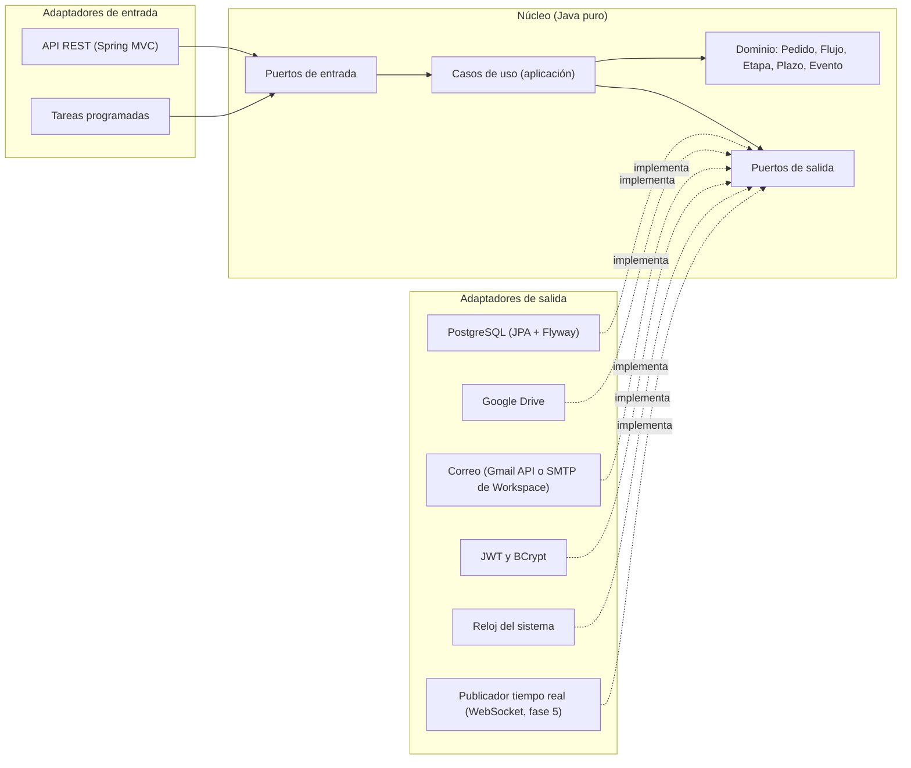
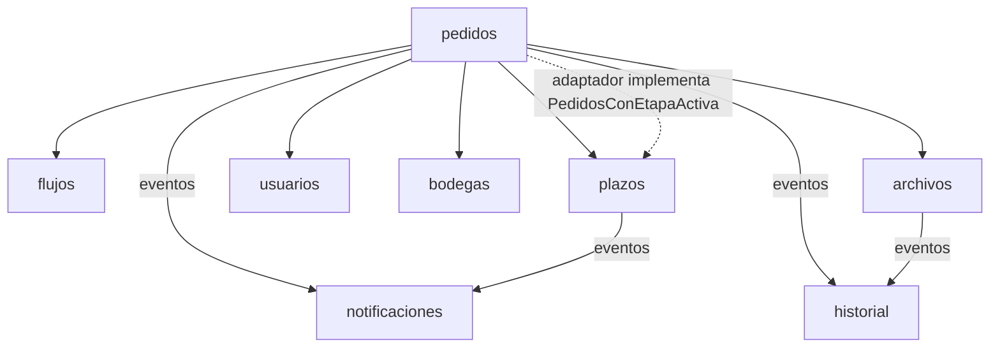
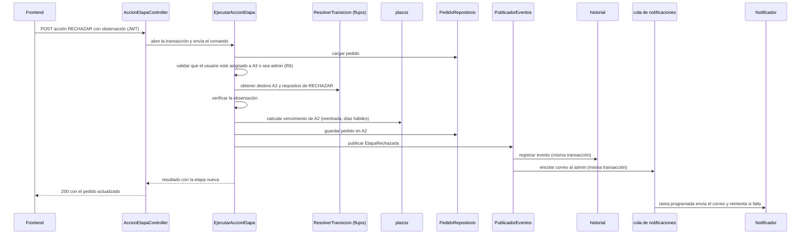

# Arquitectura del backend — Decokasa

**Fecha:** 2026-10-10 · **Fase 0, paso 0.6** · **Fuentes:** `documentos/requerimientos.md` (secciones 4.2 a 4.8 y 5), `.claude/PRPs/prds/decokasa.prd.md` y `documentos/auditoria-demo.md`. Revisado con el agente `ecc:architect` el 2026-10-10.

El backend es un monolito modular con arquitectura hexagonal (puertos y adaptadores). Tiene 8 módulos de negocio y un módulo compartido. El dominio y los casos de uso son Java puro, sin Spring, JPA, Hibernate ni Google. Todo lo externo entra por un puerto de salida y se implementa en un adaptador: PostgreSQL, Google Drive, Gmail, JWT, BCrypt, el reloj y, desde la fase 5, WebSocket (Should en el PRD; ADR pendiente). Este documento solo diseña: no hay código.

**Cómo leer este documento:**

| Marca | Significado |
| --- | --- |
| (sin marca) | Requisito de `requerimientos.md` o del PRD, o consecuencia directa de uno |
| **[P]** | Propuesta del equipo: no es un requisito aprobado. Se decide en un ADR (paso 0.7) y se puede cambiar |
| **⏸** | Depende de una decisión pendiente del cliente (sección 8.1) |

Los nombres de clases y puertos son propuestas de diseño y pueden ajustarse al implementar.

## 1. Vista general



**Regla de dependencias:** siempre hacia adentro.

- Los adaptadores dependen de los puertos y de la aplicación.
- La aplicación depende del dominio y de las interfaces de los puertos.
- El dominio no depende de nada externo.
- El cableado (qué adaptador implementa cada puerto) vive en una sola clase de configuración por módulo, en `config/`: la "raíz de composición".

**Transacciones [P]:** las abre el adaptador de entrada o un decorador transaccional que se registra en `config/`. Los casos de uso no conocen Spring (R2), y la garantía de R7 no depende de anotaciones dentro del núcleo.

## 2. Reglas de arquitectura

| # | Regla | Por qué |
| --- | --- | --- |
| R1 | `domain` y `application` no importan nada de `org.springframework`, `jakarta.persistence`, `jakarta.transaction`, `org.hibernate`, `org.postgresql`, `com.google` ni `io.jsonwebtoken` | Requisito: el dominio no depende de Spring, JPA ni Google |
| R2 | Las clases de `domain` y `application` no llevan anotaciones de Spring; se registran como beans en `config/` | Mantener el núcleo libre de framework y probarlo sin levantar Spring |
| R3 | Las entidades JPA viven solo en `adapter.out.persistence` y se mapean a objetos de dominio | Que el modelo de base de datos no se filtre al dominio |
| R4 | Un módulo usa a otro solo por sus puertos de entrada o por eventos de dominio, nunca por su dominio interno, sus repositorios o sus adaptadores. Los tipos de valor que comparten varios módulos viven en `compartido.domain`; ningún `domain` importa el `domain` de otro módulo | Evitar acoplamiento entre módulos |
| R5 | La fecha y la hora siempre salen del puerto `Reloj`, en la zona `America/Guayaquil` | Plazos en días hábiles con hora de Ecuador; el demo usaba una fecha fija (`auditoria-demo.md`, S6) |
| R6 | Los permisos por rol, por usuario asignado y por etapa se validan en el servidor, dentro del caso de uso | El demo los validaba solo en el navegador (`auditoria-demo.md`, S4) |
| R7 | El historial es de solo inserción: ninguna operación lo modifica ni lo borra | Invariante de los requerimientos (4.2) |
| R8 | El navegador nunca llama a Google: Drive y el correo solo se usan desde adaptadores del servidor | Límite de confianza de los requerimientos (4.2) |
| R9 | No hay dependencias circulares entre módulos | Evitar el acoplamiento `pedidos` ↔ `plazos` (sección 3.1) |

**Cómo se verifican [P]:** R1 a R4 y R9 con pruebas de arquitectura automáticas (ArchUnit) desde la fase 1. R5 a R8 con pruebas de dominio y de integración (sección 7). Se registra en el ADR del paso 0.7.

## 3. Módulos

| Módulo | Responsabilidad | Fase |
| --- | --- | --- |
| `compartido` | Tipos comunes: identificadores, errores de dominio base, `CodigoRol`, `CodigoPais`, `NivelUrgencia`, `AccionEtapa`; puertos `Reloj`, `PublicadorEventos` y `PublicadorTiempoReal` | 1 |
| `usuarios` | Usuarios, roles, países, inicio de sesión | 1 |
| `flujos` | Definiciones de flujo y de etapa, transiciones permitidas y requisitos de cada acción | 2 |
| `pedidos` | Pedidos, número secuencial, etapa actual, asignación y ejecución de acciones de etapa | 2 |
| `historial` | Eventos inmutables del pedido y auditoría global | 2 |
| `archivos` | Adjuntos por etapa y evento, copia a Google Drive | 3 (en la fase 2 con adaptador en memoria) |
| `notificaciones` | Correos al admin, con cola y reintentos | 3 |
| `bodegas` | Catálogo de bodegas | 4 |
| `plazos` | Calendario laboral, plazos, urgencia, cronograma, vencimientos | 2 (vencimiento por etapa y urgencia), 4 (recálculo por demora y arrastre de fechas) y 5 (cronograma contra la meta y detección de vencimientos) |

### 3.1 Cómo se relacionan



- **`pedidos` es el centro.** Ejecuta las acciones de etapa y, para eso, usa los puertos de entrada de otros módulos:
  - `ResolverTransicion` de `flujos`, que da la etapa de destino y los requisitos de la acción.
  - Los cálculos de vencimiento de `plazos`.
  - El rol del usuario, en `usuarios`.
  - La bodega elegida, en `bodegas`.
  - Los adjuntos de la etapa, en `archivos`.
- **`plazos` necesita saber qué pedidos tienen una etapa activa** para detectar vencimientos. Lo pide con su propio puerto de salida, `PedidosConEtapaActiva`, que implementa un adaptador del módulo `pedidos`. Así la dependencia va siempre de `pedidos` hacia `plazos` y no hay ciclo (R9).
- **`historial` y `notificaciones`** reaccionan a eventos de dominio y no llaman a `pedidos`.
- **Outbox [P]:** el evento del historial y la fila de la cola de notificaciones se escriben en la misma transacción que la acción. Así ninguna acción queda sin su evento (R7) ni sin su correo. El correo se envía después, desde la cola, con una tarea programada que reintenta. La fuente pide "cola y reintentos"; el patrón outbox es la propuesta para cumplirlo y se decide en el ADR del paso 0.7.

## 4. Detalle por módulo

### 4.1 `usuarios`

| Capa | Elementos |
| --- | --- |
| Dominio | `Usuario` (nombre, correo, nombre de usuario y teléfono únicos, activo, países, rol), `Rol` (nombre, permisos, etapas que atiende; es un dato que crea el admin, y los 6 roles iniciales se cargan con una migración: admin, asistente_compras, marketing, compras_china, logistica, asistente_china), `Pais` (EC activo, CO inactivo en v1), `Credencial` |
| Puertos de entrada | `IniciarSesion` (correo, usuario o teléfono + contraseña), `CrearUsuario`, `ActualizarUsuario`, `AsignarRol`, `ActivarDesactivarUsuario`, `CrearRol`, `ActualizarRol`, `ConsultarUsuarios`, `ObtenerUsuarioActual`; ⏸ `RecuperarContrasena` |
| Puertos de salida | `UsuarioRepositorio`, `RolRepositorio`, `CodificadorContrasena`, `EmisorTokens`, `Reloj` |
| Adaptadores | Entrada: `AuthController`, `UsuarioController`, `RolController`. Salida: `UsuarioJpaRepositorio`, `RolJpaRepositorio`, `BCryptCodificador`, `JwtEmisor` |
| Reglas | Solo el admin crea usuarios y roles y asigna roles (requerimientos 1.3, 4.2 #3 y 4.6). **[P]** Bloqueo temporal tras N intentos fallidos y JWT de vida corta, con N y la duración configurables (requerimientos 4.7, propuesta sin confirmar con el cliente). ⏸ Qué ve la asistente de compras en China |

### 4.2 `flujos` (motor de flujos)

| Capa | Elementos |
| --- | --- |
| Dominio | `DefinicionFlujo` (país, tipo A o B, versión, etapas en orden), `DefinicionEtapa` (número, nombre, código del rol responsable, plazo, acciones permitidas, requisitos de cada acción, automática), `TransicionPermitida` (etapa de origen, acción, etapa de destino), `MotorFlujos` (servicio de dominio **interno** de `flujos`; solo se usa detrás del puerto `ResolverTransicion`). `AccionEtapa` y `NivelUrgencia` viven en `compartido` |
| Puertos de entrada | `ConsultarDefinicionFlujo` (lo usa el frontend) y `ResolverTransicion` (lo usa `pedidos`: recibe el flujo y su versión, la etapa de origen y la acción; devuelve la etapa de destino y los requisitos de la acción: observación, urgencia, documentos y bodega) |
| Puertos de salida | `DefinicionFlujoRepositorio` |
| Adaptadores | Entrada: `FlujoController` (solo lectura). Salida: `DefinicionFlujoJpaRepositorio`. Los flujos A y B se cargan con migraciones Flyway |
| Reglas | Ver la tabla de transiciones y requisitos debajo |

**Transiciones y requisitos que exige el motor** (requerimientos 4.4, 4.5 y 1.5):

| Etapa | Acciones | Destino | Requisitos |
| --- | --- | --- | --- |
| A1 / B1 | Enviar | A2 / B2 | A1: solicitud. B1: el producto nuevo propuesto (requerimientos 1.5) |
| B2 | Aprobar / Rechazar | B3 / B1 | Rechazar: observación |
| A2 / B3 | Enviar | A3 / B4 | Documentos codificados |
| A3 / B4 | Aprobar / Rechazar | A4 / B5 — A2 / B3 | Rechazar: observación |
| A4 / B5 | Aprobar / Devolver por error / Devolver por producto nuevo | A5 / B6 — A2 / B3 — A2 / B3 | Devolver: observación y archivos opcionales; por producto nuevo, además, nivel de urgencia |
| A5 / B6 | Aprobar al terminar | A6 / B7 | Observaciones |
| A6 / B7 | Aprobar (enviado) | A7 / B8 | Packing List / BL |
| A7 / B8 | Aprobar (llegada) / Reportar demora | A8 / B9 — se queda | Reportar demora: observación y fecha (⏸ quién la calcula) |
| A8 / B9 | Aprobar | A9 / B10 | — |
| A9 / B10 | Elegir bodega / Aprobar | A10 / B11 | Bodega elegida y documentos |
| A10 / B11 | Aprobar | A11 / B12 (Fin automático) | Documentos (⏸ cuáles son "todos") |

- Las definiciones son versionadas: un pedido sigue la versión con la que se creó.
- El destino de Rechazar y Devolver depende de la etapa, y el estado y el correo se derivan del destino, no de un texto fijo. Esto corrige los errores 1 a 4 del demo (`auditoria-demo.md`, sección 6): B3 y B4 tienen solo sus propias acciones.
- Al aprobar la etapa anterior a Fin, Fin se marca sola, en ambos flujos.

### 4.3 `pedidos`

| Capa | Elementos |
| --- | --- |
| Dominio | `Pedido` (agregado: número, país, tipo de flujo, versión de flujo, creador, etapa actual, urgencia activa con su propio vencimiento, demora de aduana, bodega elegida, fechas), `NumeroPedido`, `EtapaDePedido` (entrada, salida, usuario asignado, reentradas), eventos de dominio (`PedidoCreado`, `EtapaAprobada`, `EtapaRechazada`, `PedidoDevuelto`, `DemoraReportada`, `BodegaAsignada`, `ObservacionAgregada`, `EtapaReasignada`, `PedidoFinalizado`) |
| Puertos de entrada | `CrearPedido`, `EjecutarAccionEtapa`, `AgregarObservacion` (en la etapa actual, con archivos opcionales; requerimientos 4.2 #7), `ReasignarEtapa` (admin), `ConsultarPedido` (con línea de tiempo), `BuscarPedido` (por número), `ListarBandeja` (pedidos pendientes del usuario), `ListarPedidos` |
| Puertos de salida | `PedidoRepositorio`, `GeneradorNumeroPedido`, `PublicadorEventos`, `Reloj`. Dependencias de otros módulos (R4): puertos de entrada de `flujos`, `plazos`, `usuarios`, `bodegas` y `archivos` |
| Adaptadores | Entrada: `PedidoController`, `AccionEtapaController`, `BandejaController`. Salida: `PedidoJpaRepositorio`, `SecuenciaPostgresGenerador`, `PedidosConEtapaActivaAdaptador` (implementa el puerto de `plazos`) |

**Reglas de `pedidos`:**

- **Quién crea:** el flujo A lo crea el admin y el flujo B, Compras China (requerimientos 4.2 #4). ⏸ Si el admin también puede crear pedidos del flujo B, por interpretar que "actuar en cualquier etapa" incluye B1.
- **Número:** secuencial, único y no se reutiliza (requerimientos 4.2 #5). ⏸ Formato propuesto `DK-EC-AAAA-NNNN`, con reinicio por país y año, pendiente de aprobación.
- **Una sola etapa activa.** País y tipo de flujo no cambian después de crear el pedido.
- **Quién actúa (R6):** el usuario asignado a la etapa o un admin. Por defecto está asignado cualquier usuario con el rol responsable. El admin puede reasignar la etapa (requerimientos 5). ⏸ Si se puede reasignar a un usuario de otro rol.
- **Requisitos:** no se ejecuta una acción si faltan sus requisitos (tabla de la sección 4.2). En la fase 2 los documentos se verifican contra `ConsultarAdjuntosDeEtapa` con un adaptador en memoria.
- **Plazo:** se reinicia en cada reentrada a una etapa (requerimientos 4.2, invariantes).
- **Urgencia:** tiene su propio vencimiento, desde la devolución hasta volver a A4 / B5, y se limpia al entrar a Análisis (requerimientos 4.2 #11). En el demo se borraba al primer avance (`auditoria-demo.md`, 2.1 #11). ⏸ Qué pasa si Revisión rechaza durante una urgencia (sección 8.1).

### 4.4 `historial`

| Capa | Elementos |
| --- | --- |
| Dominio | `EventoPedido` (inmutable: pedido, etapa, acción, usuario, rol, fecha y hora, observación, urgencia, motivo de retraso, ids de los adjuntos) |
| Puertos de entrada | `RegistrarEvento` (interno; lo llama el oyente de eventos), `ConsultarHistorialPedido`, `ConsultarAuditoriaGlobal` (admin) |
| Puertos de salida | `HistorialRepositorio` (solo inserta y consulta) |
| Adaptadores | Entrada: `HistorialController`, `OyenteEventosPedido` (dentro de la transacción de la acción). Salida: `HistorialJpaRepositorio` (tabla sin UPDATE ni DELETE) |
| Reglas | R7. Cada evento guarda los ids de los archivos subidos en esa acción; en el demo faltaba (`auditoria-demo.md`, 2.3) |

### 4.5 `archivos`

| Capa | Elementos |
| --- | --- |
| Dominio | `Adjunto` (pedido, etapa, evento, nombre, tipo, tamaño, id en el almacén, estado PENDIENTE, COPIADO o FALLIDO, intentos), `PoliticaArchivos` (máximo 100 MB por archivo; ⏸ formatos aceptados) |
| Puertos de entrada | `SubirArchivo`, `ConsultarAdjuntosDeEtapa` (lo usa `pedidos` para revisar los requisitos), `ObtenerEnlaceArchivo`, `ReintentarCopiasPendientes` (tarea programada), `ConsultarCopiasFallidas` (admin; requerimientos 4.8) |
| Puertos de salida | `AlmacenArchivos` (copia definitiva), `AlmacenTemporal` (archivo recibido antes de copiarlo), `AdjuntoRepositorio`, `PublicadorEventos` |
| Adaptadores | Entrada: `ArchivoController` (subida por partes), `TareaCopiaArchivos`. Salida: `GoogleDriveAlmacen` (cuenta de servicio y unidad compartida; carpeta por país y pedido según requerimientos 4.7, con subcarpetas por año y etapa **[P]**), `AlmacenEnMemoria` (pruebas y fase 2), `DiscoLocalTemporal`, `AdjuntoJpaRepositorio` |
| Reglas | El servidor valida tipo, tamaño y nombre; el nombre nunca se usa sin codificar en enlaces (`auditoria-demo.md`, S9). El enlace lo entrega Drive. ⏸ Quién tiene acceso directo a la carpeta de Drive |

### 4.6 `notificaciones`

| Capa | Elementos |
| --- | --- |
| Dominio | `Notificacion` (destinatario, plantilla, datos del evento, estado PENDIENTE, ENVIADA o FALLIDA, intentos), `PlantillaCorreo` |
| Puertos de entrada | `EncolarNotificacion` (lo llama el oyente de eventos), `EnviarNotificacionesPendientes` (tarea programada), `ConsultarNotificaciones` (admin; reemplaza la vista de Gmail del demo) |
| Puertos de salida | `Notificador` (envío de correo), `NotificacionRepositorio` (cola), `DirectorioDestinatarios` (a quién se notifica) |
| Adaptadores | Entrada: `OyenteEventosNotificacion` (dentro de la transacción de la acción: solo inserta en la cola), `TareaEnvioCorreos`, `NotificacionController`. Salida: `GmailNotificador` **[P]** (Gmail API con cuenta de servicio y delegación limitada al buzón remitente; alternativa: SMTP de Google Workspace, como deja abierto requerimientos 3; se decide en ADR), `NotificadorEnMemoria` (pruebas), `NotificacionJpaRepositorio` |
| Reglas | Cada etapa y cada vencimiento notifican al admin (requerimientos 4.2 #16). ⏸ Si el responsable de la etapa también recibe correo: `DirectorioDestinatarios` permite agregarlo sin tocar el resto |

### 4.7 `plazos`

| Capa | Elementos |
| --- | --- |
| Dominio | `CalendarioLaboral` (lunes a viernes, zona `America/Guayaquil`, ⏸ feriados), `Plazo` (en horas o días, hábiles o corridos según la etapa), `Cronograma` (fechas planificadas por etapa, meta de días configurable) |
| Puertos de entrada | `CalcularVencimientoEtapa` (lo usa `pedidos` al entrar a una etapa), `CalcularVencimientoUrgencia` (desde la devolución hasta volver a A4 / B5), `RecalcularPorDemora`, `CalcularCronograma`, `DetectarVencimientos` (tarea programada), `ListarPedidosVencidos` (admin, por etapa y por responsable, con el motivo; requerimientos 4.8), `ConfigurarMeta` (admin), `ConfigurarFeriados` (admin; propuesta vigente, Could en el PRD) |
| Puertos de salida | `ConfiguracionPlazosRepositorio` (meta y feriados), `PedidosConEtapaActiva` (lo implementa un adaptador de `pedidos`), `PublicadorEventos` (`PlazoVencido`), `Reloj` (de `compartido`) |
| Adaptadores | Entrada: `CronogramaController`, `TareaVencimientos`. Salida: `ConfiguracionPlazosJpaRepositorio`. `RelojSistema` y `RelojFijo` (para pruebas) viven en `compartido` |

**Reglas de `plazos`:**

- **Fechas:** una fecha que cae en fin de semana pasa al lunes, también la llegada; un retraso arrastra todas las fechas siguientes; el plazo se reinicia en cada reentrada (requerimientos 4.2).
- **Plazos confirmados:** 24 h en Codificación, Revisión, Autorización de salida y Bodega; 3 días en Análisis; 10 días en Embarque.
- **⏸ Pendientes:** Fabricación, Incidencias, el tránsito de 45 días (hábiles o corridos), si las urgencias son en horas hábiles o corridas, y la meta de días.

### 4.8 `bodegas`

| Capa | Elementos |
| --- | --- |
| Dominio | `Bodega` (nombre, ciudad, activa) |
| Puertos de entrada | `CrearBodega`, `ActualizarBodega`, `ActivarDesactivarBodega`, `ListarBodegas`, `ConsultarBodegaActiva` (lo usa `pedidos`) |
| Puertos de salida | `BodegaRepositorio` |
| Adaptadores | Entrada: `BodegaController`. Salida: `BodegaJpaRepositorio`. Quito, Guayaquil e Ibarra se cargan con una migración |
| Reglas | Mantiene el catálogo Logística (Anderson), según requerimientos 4.2 #14. ⏸ Si el admin también puede hacerlo (el demo lo permitía) |

### 4.9 Puertos previstos para fases posteriores

| Puerto | Módulo | Fase | Estado |
| --- | --- | --- | --- |
| `PublicadorTiempoReal` | `compartido` | 5 | **[P]** Adaptador WebSocket (STOMP) para que un check se vea sin recargar. Should en el PRD; no está en el stack fijo de `CLAUDE.md` |
| `AsistenteIA` | por definir | 7 | ⏸ El caso de uso de la API de Claude no está definido. La clave vive solo en el servidor y no se envían documentos sin aprobación del cliente (requerimientos 4.7) |
| Flujos de Colombia | `flujos` (datos) | 7 | ⏸ Proceso sin definir; entra como nuevas definiciones de flujo, sin cambiar el motor |

## 5. Estructura de paquetes

**[P]** La base es `com.decokasa.seguimiento`. Es una decisión del equipo y se registra en el ADR del paso 0.7. Los módulos se nombran en español y las capas con los nombres técnicos convencionales en inglés (`domain`, `application`, `adapter`), según la regla de idioma de `CLAUDE.md`.

```text
backend/
├── build.gradle
├── settings.gradle
└── src/
    ├── main/
    │   ├── java/com/decokasa/seguimiento/
    │   │   ├── SeguimientoApplication.java        ← arranque de Spring Boot
    │   │   ├── compartido/
    │   │   │   ├── domain/                        ← Identificador, ErrorDeDominio, EventoDeDominio,
    │   │   │   │                                     CodigoRol, CodigoPais, NivelUrgencia, AccionEtapa
    │   │   │   ├── application/port/out/          ← Reloj, PublicadorEventos, PublicadorTiempoReal
    │   │   │   └── adapter/
    │   │   │       ├── in/web/                    ← manejo global de errores (dominio → HTTP)
    │   │   │       └── out/                       ← RelojSistema, RelojFijo, publicador de eventos, WebSocket
    │   │   ├── usuarios/
    │   │   │   ├── domain/
    │   │   │   ├── application/
    │   │   │   │   ├── port/in/
    │   │   │   │   ├── port/out/
    │   │   │   │   └── usecase/
    │   │   │   ├── adapter/
    │   │   │   │   ├── in/web/
    │   │   │   │   └── out/
    │   │   │   │       ├── persistence/           ← entidades JPA y repositorios
    │   │   │   │       └── security/              ← BCrypt y JWT
    │   │   │   └── config/                        ← raíz de composición y transacciones del módulo
    │   │   ├── flujos/          (misma estructura)
    │   │   ├── pedidos/         (misma estructura)
    │   │   ├── historial/       (misma estructura)
    │   │   ├── archivos/
    │   │   │   └── adapter/out/drive/             ← GoogleDriveAlmacen
    │   │   ├── notificaciones/
    │   │   │   └── adapter/out/correo/            ← GmailNotificador (o SMTP, según el ADR)
    │   │   ├── plazos/          (misma estructura)
    │   │   ├── bodegas/         (misma estructura)
    │   │   └── configuracion/                     ← seguridad web, CORS, tareas programadas, OpenAPI
    │   └── resources/
    │       ├── application.yml
    │       └── db/migration/                      ← migraciones Flyway V1, V2…
    └── test/java/com/decokasa/seguimiento/
        ├── arquitectura/                          ← pruebas ArchUnit de R1 a R4 y R9 [P]
        └── <módulo>/
            ├── domain/                            ← pruebas puras
            ├── application/                       ← casos de uso con adaptadores falsos
            └── adapter/                           ← integración con Testcontainers
```

## 6. Recorrido de una acción de etapa

Ejemplo: Marcela rechaza en A3 (Revisión) con una observación.



Si falta la observación, si el usuario no está asignado ni es admin, o si la acción no está permitida en A3, el caso de uso lanza un error de dominio. El adaptador web lo traduce a una respuesta HTTP 400, 403 o 409 y la transacción se revierte sin guardar nada.

## 7. Estrategia de pruebas por frontera

| Nivel | Qué prueba | Herramienta | Desde la fase |
| --- | --- | --- | --- |
| Dominio | Reglas puras, sin mocks ni Spring: `Usuario`; luego `MotorFlujos`, `CalendarioLaboral`, `Cronograma`, `Pedido` | JUnit 5 | 1 (`usuarios`), 2 (motor y plazos) |
| Casos de uso | Orquestación con adaptadores falsos en memoria (`RelojFijo`, `AlmacenEnMemoria`, `NotificadorEnMemoria`) | JUnit 5 | 1 |
| Contrato de puertos | La misma batería de pruebas para cada implementación de `AlmacenArchivos` y `Notificador` (real y falsa) | JUnit 5 | 3 |
| Adaptadores | Repositorios JPA y migraciones contra PostgreSQL real; secuencia del número de pedido | Testcontainers | 1 (usuarios), 2 (secuencia de pedido) |
| Arquitectura **[P]** | R1 a R4 y R9 (ver ADR) | ArchUnit | 1 |
| Punta a punta | Recorridos completos desde el frontend | Playwright | 2 (A1 a A4), 4 (flujo A), 6 (flujos A y B) |

R5 a R8 se cubren con pruebas de dominio (R5, R6, R7) y de integración (R7 en la base de datos y R8 en la configuración de seguridad web).

La lógica de `frontend/src/utils/orderState.ts` del demo sirve de referencia de casos para las pruebas del motor. Sus errores documentados (`auditoria-demo.md`, sección 6) se convierten en pruebas que deben fallar si se repiten.

## 8. Decisiones pendientes

### 8.1 Del cliente

Ninguna bloquea la arquitectura: cada una se resuelve con un valor configurable o con un adaptador, sin cambiar el dominio. La columna "Valor provisional" repite la propuesta de `requerimientos.md` (tabla "Por confirmar con el cliente") y del PRD; no es una respuesta del cliente.

| Decisión pendiente | Módulo afectado | Cómo lo absorbe la arquitectura | Valor provisional |
| --- | --- | --- | --- |
| Formato del número de pedido | `pedidos` | `NumeroPedido` y `GeneradorNumeroPedido` encapsulan el formato | `DK-EC-AAAA-NNNN`, con reinicio por país y año |
| Meta de días | `plazos` | Meta configurable por el admin | 90 |
| Feriados de Ecuador y China | `plazos` | `CalendarioLaboral` lee los feriados de `ConfiguracionPlazosRepositorio` | Calendario de feriados de Ecuador editable por el admin; China sin definir |
| Plazo de Fabricación | `flujos` | Plazo por etapa en la definición del flujo (datos) | Sin valor del cliente. Propuesta: 31 días, que es la duración de fabricación en la calculadora (días corridos), configurable |
| Plazo de Incidencias | `flujos` | Igual | Sin plazo hasta que el cliente lo defina |
| Tránsito de 45 días: hábiles o corridos | `plazos`, `flujos` | Tipo de plazo por etapa (hábil o corrido) | Hábiles |
| Urgencias en horas hábiles o corridas | `plazos` | Mismo tipo de plazo | Hábiles |
| Rechazo en Revisión durante una urgencia: ¿se mantiene el vencimiento de la urgencia o se reinicia? | `plazos`, `pedidos` | Regla configurable | No definido en las fuentes |
| Recálculo en aduana: lo escribe David o lo calcula el sistema | `pedidos`, `plazos` | `RecalcularPorDemora` recibe la fecha o la calcula | David escribe la fecha |
| ¿El responsable también recibe correo? | `notificaciones` | `DirectorioDestinatarios` | Correo al admin y al responsable; el admin puede apagarlo |
| Formatos de archivo aceptados | `archivos` | `PoliticaArchivos` | PDF, Word, Excel, imágenes y ZIP; 100 MB |
| Documentos de Incidencias ("todos los documentos") | `flujos` | Requisitos de la etapa en la definición del flujo | Sin definir |
| Qué ve la asistente de compras en China | `usuarios`, `pedidos` | Permisos del rol `asistente_china` | Solo consulta |
| ¿El admin crea pedidos del flujo B? | `pedidos` | Permiso de `CrearPedido` | Solo Compras China |
| ¿Se reasigna a un usuario de otro rol? | `pedidos` | Validación de `ReasignarEtapa` | Solo usuarios con el rol responsable |
| ¿El admin mantiene el catálogo de bodegas? | `bodegas` | Permiso de los casos de uso de bodegas | Solo Logística |
| Pausar o cancelar un pedido (el demo lo tenía) | `pedidos` | Nuevos casos de uso, si se aprueban | No se incluye |
| Checklist por etapa (el demo lo tenía) | `flujos`, `pedidos` | Requisitos adicionales de la etapa, si se aprueban | No se incluye |
| Recuperación de contraseña | `usuarios` | Nuevo caso de uso `RecuperarContrasena` | Sin implementar |
| Acceso directo a la carpeta de Drive | `archivos` | Configuración de la unidad compartida (fuera del código) | Solo la cuenta de servicio |
| Proceso de Colombia | `flujos` | Nuevas definiciones de flujo por país | Inactivo en v1 |
| Caso de uso de la API de Claude | por definir | Puerto `AsistenteIA` | Fase 7 |

### 8.2 Del equipo (propuestas para el ADR del paso 0.7)

Ninguna es un requisito del cliente. Se registran en ADR y se pueden cambiar.

| Propuesta | Dónde | Alternativa |
| --- | --- | --- |
| Monolito modular hexagonal con las reglas R1 a R9 | Secciones 1 y 2 | Capas tradicionales de Spring |
| Verificar R1 a R4 y R9 con ArchUnit | Sección 2 | Solo revisión de código |
| Transacción abierta por el adaptador de entrada o por un decorador en `config/` | Sección 1 | Anotaciones transaccionales en los casos de uso (rompe R2) |
| Outbox: historial y cola de correos en la misma transacción | Sección 3.1 | Envío directo después de confirmar (puede perder correos) |
| Gmail API con delegación limitada al buzón remitente | Sección 4.6 | SMTP de Google Workspace (requerimientos 3) |
| Subcarpetas de Drive por año y etapa | Sección 4.5 | Solo país y pedido (requerimientos 4.7) |
| WebSocket (STOMP) para el tiempo real, desde la fase 5 | Sección 4.9 | Consultas periódicas del frontend |
| Bloqueo temporal tras N intentos fallidos y JWT de vida corta | Sección 4.1 | Sin bloqueo |
| Paquete base `com.decokasa.seguimiento` | Sección 5 | Otro nombre |
| Propuesta de 31 días para Fabricación | Sección 8.1 | El valor que fije el cliente |

## 9. Correspondencia con el demo

| Función del demo (`frontend/src/utils/orderState.ts`) | Caso de uso en el backend |
| --- | --- |
| `advanceOrderStage` | `EjecutarAccionEtapa` con APROBAR o ENVIAR |
| `rejectStageWithObservations` | `EjecutarAccionEtapa` con RECHAZAR |
| `returnToCodingWithUrgency` | `EjecutarAccionEtapa` con DEVOLVER_POR_ERROR o DEVOLVER_POR_PRODUCTO_NUEVO |
| `reportCustomsDelay` | `EjecutarAccionEtapa` con REPORTAR_DEMORA y `RecalcularPorDemora` |
| `setOrderDestinationWarehouse` | `EjecutarAccionEtapa` con ELEGIR_BODEGA |
| `uploadStageFile` | `SubirArchivo` |
| `addStageObservation` | `AgregarObservacion` (requerimientos 4.2 #7), además de la observación que acompaña a cada acción |
| `recalculateOrderStages` | `CalcularCronograma` |
| `setOrderStatusChange` (pausar, cancelar) | No está en los requerimientos; ⏸ sección 8.1 |
| `toggleStageChecklistItem` | No está en los requerimientos; ⏸ sección 8.1 |

## 10. Siguientes pasos

- **Paso 0.7:** registrar en ADR las propuestas de la sección 8.2: monolito modular hexagonal; R1 a R4 y R9 verificadas con ArchUnit, y R5 a R8 con pruebas de dominio e integración; transacciones fuera del núcleo; outbox; correo; WebSocket; paquete base.
- **Paso 0.8:** el contrato OpenAPI sigue los puertos de entrada de la sección 4.
- **Paso 0.9:** el modelo de datos sigue los objetos de dominio y los repositorios de la sección 4, con los roles como datos, los requisitos por etapa, el vencimiento de la urgencia y la asignación de etapas.
- **Paso 0.10:** los diagramas C4 y de secuencia parten de las secciones 1, 3.1 y 6.
