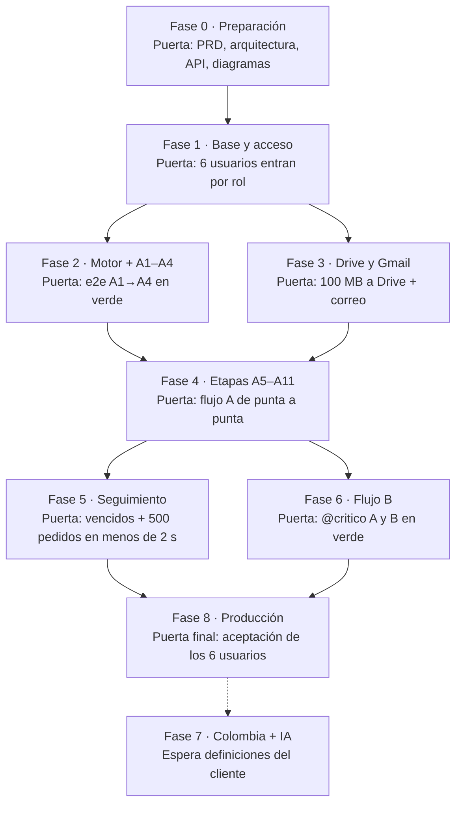

# Decokasa — Manual paso a paso con skills

Oct 9, 2026 · @Richard

## Cómo usar este manual

El proyecto avanza en 9 fases (de la 0 a la 8), siempre en este orden. Cada paso dice qué skill usar, qué escribir en Claude Code y qué debe quedar listo. No pases a la fase siguiente hasta cumplir la **puerta de salida** de la fase actual.

### Reglas que no cambian

1. **Una fase a la vez.** No se adelanta trabajo de otra fase, salvo las parejas que pueden ir en paralelo: 2 con 3, y 5 con 6.
2. **El stack no cambia:** React 19 + Vite + TypeScript + Tailwind 4 + shadcn/ui + TanStack Query en el frontend. Spring Boot 3 + Java 21 + PostgreSQL + Flyway + Docker en el backend.
3. **Primero las pruebas, después el código.** El paso Test siempre va antes de Implement.
4. **La fuente de verdad es `documentos/requerimientos.md`.** Si un requisito cambia, primero se actualiza ese archivo y después el código.
5. **Una rama por fase**, con el nombre `fase-N-nombre`, creada desde `develop`. Al terminar, se abre un pull request hacia `develop`. Nunca se hace commit directo en `main` ni en `develop`.
6. **`main` solo cambia cuando hay una versión que entregar.** Se hace merge de `develop` en `main` y se etiqueta la versión (por ejemplo, `v1.0.0`).
7. **Cada decisión importante va en un ADR** (`documentos/adr/`).

### Estructura del repositorio (se crea en la fase 1)

```text
decoWeb/
├── frontend/            ← el demo de AI Studio, migrado
├── backend/             ← Spring Boot (Gradle)
├── documentos/          ← requerimientos, ADR, diagramas, guías
├── .claude/PRPs/        ← PRD y planes por fase
├── docker-compose.yml
└── CLAUDE.md            ← memoria del proyecto
```

### Ritual al empezar cada sesión

```text
/ecc:resume-session
```

Después escribe: "Estamos en la fase N, paso N.X del manual. Continúa desde ahí."

### Ritual al terminar cada sesión

```text
/ecc:save-session
```

Si aprendiste algo que se repetirá (un error, un patrón o una decisión), agrégalo:

```text
/ecc:learn <lo que aprendiste, en una frase>
```

### El ciclo dentro de cada fase

Cada fase de la 1 a la 8 repite estos 8 pasos. En las secciones de cada fase solo se indica qué agregar a este ciclo.

| Paso | Escribe | Listo cuando |
| --- | --- | --- |
| A. Rama | `git checkout develop`, `git pull`, `git checkout -b fase-N-nombre` | Estás en la rama nueva, creada desde un `develop` al día |
| B. Plan | `/ecc:prp-plan .claude/PRPs/prds/decokasa.prd.md` | Existe el plan de la fase en `.claude/PRPs/plans/` |
| C. Test | `/ecc:tdd-workflow` + la skill de pruebas de la fase | Las pruebas nuevas fallan |
| D. Implement | `/ecc:prp-implement <ruta del plan>` | Todas las pruebas pasan |
| E. Review | `/code-review` + el revisor de la fase | Sin hallazgos críticos ni altos |
| F. Verify | `/ecc:verification-loop` y `/run` | Compila, pruebas en verde y la app funciona |
| G. Remember | `/ecc:update-codemaps`, `/ecc:update-docs`, `/ecc:save-session` | Documentación y memoria al día |
| H. Improve y cierre | `/simplify`, `/ecc:learn-eval`, `/ecc:prp-commit`, `/ecc:prp-pr` (hacia `develop`) | Pull request hacia `develop` aprobado y con merge |

## Mapa del proyecto



*Las fases 2 y 3, y 5 y 6, van en paralelo; la 7 espera al cliente.*

La fase 7 se muestra al final, con flecha punteada, porque el cliente la dejó para después: el sistema puede salir a producción solo con Ecuador y sumar Colombia e IA más tarde.

## Fase 0 — Preparación

En esta fase no se programa. Se deja todo decidido y documentado: auditoría del demo, PRD en el formato que usan las skills, arquitectura, contrato de API, modelo de datos, diagramas, sistema de diseño e historias en Jira. Rama: `fase-0-preparacion`.

**Paso 0.1 — Commit inicial.** Skill: `/ecc:prp-commit`

```text
/ecc:prp-commit Commit inicial: demo de Google AI Studio, documentos de requerimientos y skills del proyecto. Antes, agrega a .gitignore: .claude/skills/, ~$*.docx, node_modules/, .env
```

Listo cuando `git status` queda limpio.

**Paso 0.2 — Memoria del proyecto.** Skill: `/init`

```text
/init Crea CLAUDE.md para Decokasa. Incluye: el stack fijo (sección "Reglas que no cambian" del manual), la estructura frontend/ backend/ documentos/, que la fuente de verdad es documentos/requerimientos.md, que se trabaja con TDD, una rama por fase, plazos en días hábiles con hora de Ecuador, y que todo el código y los comentarios van en español salvo los nombres técnicos.
```

Listo cuando existe `CLAUDE.md` y lo revisaste.

**Paso 0.3 — Auditoría del demo contra los requerimientos.** Skills: `/ecc:react-review`, `impeccable`

```text
Audita el demo de src/ contra documentos/requerimientos.md. Para cada requisito de las secciones 4.2 a 4.5 indica: cumple, cumple parcialmente o falta, con el archivo donde está. Lista qué componentes se reutilizan, cuáles se reescriben y cuáles se descartan. Guarda el resultado en documentos/auditoria-demo.md.
```

```text
/ecc:react-review src/
```

```text
/impeccable audit src/components
```

Listo cuando `documentos/auditoria-demo.md` tiene la tabla de requisitos y la lista de componentes.

**Paso 0.4 — Seguridad del demo.** Skill: `/ecc:security-scan`

```text
/ecc:security-scan Revisa src/ y package.json. Marca todo lo que no puede pasar a producción: permisos solo en el navegador, datos falsos, claves, dependencias sin usar (@google/genai, express). Agrega los hallazgos a documentos/auditoria-demo.md.
```

**Paso 0.5 — PRD en formato de skills.** Skill: `/ecc:prp-prd`

```text
/ecc:prp-prd Genera .claude/PRPs/prds/decokasa.prd.md a partir de documentos/requerimientos.md, sin preguntarme nada: toda la información está ahí. La tabla de fases debe tener exactamente estas 8 fases: 1 Base y acceso, 2 Motor de flujo y A1-A4, 3 Drive y Gmail, 4 Etapas A5-A11, 5 Seguimiento y plazos, 6 Flujo B, 7 Colombia y API de Claude, 8 Producción. Las fases 2 y 3 van en paralelo, igual que las fases 5 y 6.
```

Listo cuando el PRD tiene la tabla de 8 fases, todas en estado `pending`. Esta tabla es la que lee `/ecc:prp-plan` en cada fase.

**Paso 0.6 — Arquitectura limpia.** Skills: `ecc:hexagonal-architecture` y agente `ecc:architect`

```text
/ecc:hexagonal-architecture Diseña la arquitectura del backend de Decokasa con puertos y adaptadores. Módulos: usuarios y roles, pedidos, motor de flujos (definiciones de flujo y etapa, transiciones), historial, archivos (puerto hacia Google Drive), notificaciones (puerto hacia Gmail), plazos y cronograma (días hábiles, hora de Ecuador), bodegas. El dominio no depende de Spring, JPA ni Google. Guarda el resultado en documentos/arquitectura.md con la estructura de paquetes.
```

Listo cuando `documentos/arquitectura.md` tiene los módulos, sus puertos y la estructura de paquetes.

**Paso 0.7 — Decisiones (ADR).** Skill: `ecc:architecture-decision-records`

```text
/ecc:architecture-decision-records Crea en documentos/adr/ un ADR por cada decisión de la sección "Registro de decisiones" de documentos/requerimientos.md: stack, autenticación propia con JWT, Drive por cuenta de servicio, flujo configurable por datos, alertas por Gmail al admin, días hábiles con hora de Ecuador, documentos sin validación, solo web, Ecuador primero, monorepo frontend/ y backend/ con Gradle.
```

**Paso 0.8 — Contrato de API.** Skills: `ecc:api-design`, `ecc:contract-first`

```text
/ecc:contract-first Escribe documentos/api/openapi.yaml para todo el MVP: autenticación, usuarios y roles, pedidos (crear, listar, buscar, detalle con línea de tiempo), transiciones de etapa (aprobar, rechazar, devolver con urgencia, reportar demora), archivos, bodegas, cronograma. Usa la tabla de transiciones de las secciones 4.4 y 4.5 de requerimientos.md. Revisa el resultado con /ecc:api-design.
```

Listo cuando el OpenAPI cubre todas las transiciones de los flujos A y B.

**Paso 0.9 — Modelo de datos.** Skills: `ecc:postgres-patterns`, `ecc:jpa-patterns`

```text
/ecc:postgres-patterns Diseña el esquema PostgreSQL a partir de la sección 4.6 de requerimientos.md. Requisitos: historial de solo inserción, número de pedido DK-EC-AAAA-NNNN con secuencia por país y año, definiciones de flujo versionadas, índices para buscar pedidos y para encontrar los vencidos. Guarda el resultado en documentos/modelo-datos.md.
```

**Paso 0.10 — Diagramas.** Skill: `/design-doc-mermaid`

```text
/design-doc-mermaid Crea en documentos/diagramas/ estos diagramas Mermaid: C4 de contexto y de contenedores; diagrama de estados del flujo A y del flujo B con sus devoluciones; secuencia de una transición (usuario → API → motor → historial → Drive → Gmail); diagrama ER a partir de documentos/modelo-datos.md.
```

Listo cuando los 5 diagramas se ven bien en la vista previa de VS Code.

**Paso 0.11 — Sistema de diseño.** Skills: `ecc:design-system`, `shadcn`

```text
/ecc:design-system Define el sistema de diseño de Decokasa sobre shadcn/ui y Tailwind 4: colores de marca (si no los tengo, deja tokens de ejemplo y márcalos como pendientes), tipografía, espaciado, y los componentes base: tabla de pedidos, línea de tiempo horizontal, panel de etapa con check, observaciones y archivos, badge de urgencia y badge de vencido. Guarda el resultado en documentos/diseno/DESIGN.md.
```

Antes de este paso, pide al cliente el logo y los colores de la marca.

**Paso 0.12 — Historias en Jira.** Skill: `/ecc:jira`

```text
/ecc:jira Crea una épica por cada fase del PRD .claude/PRPs/prds/decokasa.prd.md y sus historias de usuario con criterios de aceptación tomados de requerimientos.md.
```

Si todavía no tienen Jira, este paso se salta y se usa la tabla de fases del PRD.

**Paso 0.13 — Cierre.** Haz los pasos G y H del ciclo.

### Puerta de salida de la fase 0

- [ ] `CLAUDE.md` creado y revisado
- [ ] `documentos/auditoria-demo.md` con los componentes clasificados
- [ ] `.claude/PRPs/prds/decokasa.prd.md` con 8 fases
- [ ] `documentos/arquitectura.md`, `documentos/modelo-datos.md` y `documentos/api/openapi.yaml`
- [ ] ADR en `documentos/adr/`
- [ ] 5 diagramas en `documentos/diagramas/`
- [ ] `documentos/diseno/DESIGN.md`
- [ ] PR de la fase 0 aprobado

## Fase 1 — Base y acceso

Al terminar esta fase, las 6 personas entran al sistema con correo, usuario o teléfono y ven su dashboard. Mirian puede crear usuarios y asignar roles. Rama: `fase-1-base-acceso`.

**Paso 1.1 — Plan.** Haz los pasos A y B del ciclo.

```text
/ecc:prp-plan .claude/PRPs/prds/decokasa.prd.md
```

Revisa que el plan haya elegido la fase 1.

**Paso 1.2 — Frontend en su carpeta.** Skills: `ecc:vite-patterns`, `shadcn`, `tanstack-query-best-practices`

```text
/ecc:vite-patterns Mueve el demo a frontend/ sin perder el historial de git (git mv). Quita @google/genai, express y dotenv. Agrega React Router, TanStack Query, React Hook Form y Zod. Configura el proxy de Vite hacia el backend en http://localhost:8080 y la variable VITE_API_URL. Aplica los componentes clasificados como "descartar" en documentos/auditoria-demo.md.
```

```text
Inicializa shadcn/ui en frontend/ con los tokens de documentos/diseno/DESIGN.md.
```

Listo cuando `npm run dev` dentro de `frontend/` levanta el demo igual que antes.

**Paso 1.3 — Esqueleto del backend.** Skills: `ecc:springboot-patterns`, `/ecc:gradle-build`

```text
/ecc:springboot-patterns Crea backend/ con Spring Boot 3, Java 21 y Gradle. Dependencias: web, security, data-jpa, validation, flyway, postgresql, actuator, springdoc-openapi, websocket, testcontainers. Usa la estructura de paquetes de documentos/arquitectura.md. Agrega un endpoint /api/salud.
```

**Paso 1.4 — Docker.** Skill: `ecc:docker-patterns`

```text
/ecc:docker-patterns Crea docker-compose.yml en la raíz con PostgreSQL 17, el backend y el frontend. Usa variables en .env y crea .env.example con todas las variables sin valores reales.
```

Listo cuando `docker compose up` levanta los 3 servicios y `/api/salud` responde.

**Paso 1.5 — Migración inicial.** Skill: `ecc:database-migrations`

```text
/ecc:database-migrations Crea la migración Flyway V1 con las tablas usuario, rol, usuario_rol y pais, según documentos/modelo-datos.md. Correo, usuario y teléfono son únicos. Siembra los 6 roles y los 6 usuarios de la sección 1.2 de requerimientos.md, con contraseñas temporales.
```

**Paso 1.6 — Pruebas primero.** Skills: `ecc:tdd-workflow`, `ecc:springboot-tdd`, `/ecc:react-test`

```text
/ecc:springboot-tdd Escribe las pruebas, antes del código, para: login con correo, con usuario y con teléfono; contraseña incorrecta; bloqueo tras 5 intentos fallidos; JWT con rol; solo el admin crea usuarios y asigna roles; un usuario sin rol no entra.
```

```text
/ecc:react-test Escribe las pruebas de la pantalla de login, de las rutas protegidas por rol y de la gestión de usuarios. Deben fallar.
```

**Paso 1.7 — Implementar el backend.** Skills: `/ecc:prp-implement`, `ecc:springboot-security`

```text
/ecc:prp-implement .claude/PRPs/plans/<plan de la fase 1>.md
```

```text
/ecc:springboot-security Revisa que la configuración de Spring Security cumpla: BCrypt, JWT de vida corta con refresh, permisos revisados en el servidor, CORS solo para el frontend y cabeceras de seguridad.
```

**Paso 1.8 — Implementar el frontend.** Skills: `ecc:react-patterns`, `shadcn`, `tanstack-query-best-practices`

```text
Conecta la pantalla de login y la gestión de usuarios del demo a la API real con TanStack Query. Crea un dashboard vacío por rol (admin, codificación, revisión, compras China, logística, consulta) y rutas protegidas. Usa React Hook Form y Zod en los formularios.
```

**Paso 1.9 — Revisión.** Skills: `/code-review`, agente `ecc:java-reviewer`, `/ecc:react-review`, `/security-review`

```text
/code-review
```

```text
Usa el agente ecc:java-reviewer sobre backend/ y el agente ecc:typescript-reviewer sobre frontend/src/.
```

```text
/security-review
```

En esta fase `/security-review` es obligatorio, porque toca la autenticación.

**Paso 1.10 — Verificación.** Skills: `ecc:springboot-verification`, `/ecc:verification-loop`, `/ecc:test-coverage`, `/run`

```text
/ecc:springboot-verification
```

```text
/ecc:test-coverage
```

```text
/run Entra con los 6 usuarios de prueba y confirma que cada uno ve su dashboard.
```

**Paso 1.11 — Cierre.** Haz los pasos G y H. Marca la fase 1 como `complete` en el PRD.

### Puerta de salida de la fase 1

- [ ] `docker compose up` levanta PostgreSQL, el backend y el frontend
- [ ] Los 6 usuarios entran con correo, usuario o teléfono
- [ ] Mirian crea un usuario y le asigna un rol
- [ ] Un usuario no puede abrir el dashboard de otro rol, ni por la pantalla ni por la API
- [ ] Cobertura de pruebas del backend ≥ 80 %
- [ ] `/security-review` sin hallazgos críticos ni altos
- [ ] David probó el acceso desde China (si aún no hay servidor, se prueba en la fase 8)

## Fase 2 — Motor de flujo y etapas A1–A4

Es la fase más importante. Al terminar, un pedido se crea con número, pasa por Codificación y Revisión, y llega a Análisis en China, con rechazos, devoluciones urgentes e historial completo. Rama: `fase-2-motor-flujo`. Puede ir en paralelo con la fase 3.

**Paso 2.1 — Plan.** Haz los pasos A y B del ciclo. Si vas a trabajar la fase 3 al mismo tiempo, ábrela en otra copia del repositorio:

```text
Crea un worktree en ../decoWeb-fase3 con la rama fase-3-drive-gmail.
```

**Paso 2.2 — Esquema del motor.** Skills: `ecc:database-migrations`, `ecc:postgres-patterns`

```text
/ecc:database-migrations Crea la migración V2: definicion_flujo (versionada), definicion_etapa (rol responsable, plazo en horas hábiles, acciones permitidas, automática), transicion_permitida, pedido (número DK-EC-AAAA-NNNN), evento (solo inserción, con observación, urgencia y motivo de retraso). Siembra el flujo A de Ecuador versión 1 con las 11 etapas y las transiciones de la sección 4.4 de requerimientos.md.
```

Pide al agente `ecc:database-reviewer` que revise la migración antes de seguir.

**Paso 2.3 — Pruebas del motor (dominio puro).** Skills: `ecc:tdd-workflow`, `ecc:springboot-tdd`

```text
/ecc:tdd-workflow Escribe las pruebas unitarias del motor de flujos, sin Spring ni base de datos. Casos:
1. Crear un pedido genera DK-EC-2026-0001 y el siguiente DK-EC-2026-0002.
2. A1 enviar pasa a A2.
3. A3 rechazar sin observación falla; con observación vuelve a A2.
4. A4 devolver por error vuelve a A2.
5. A4 devolver por producto nuevo exige urgencia (4, 12 o 24 h) y fija el plazo hasta volver a A4.
6. Solo el rol responsable de la etapa o un admin puede actuar.
7. El admin puede reasignar una etapa.
8. Cada acción agrega un evento; los eventos nunca se modifican.
9. Plazos en días hábiles con hora de Ecuador: un plazo que vence en sábado pasa al lunes.
10. Un pedido solo está en una etapa activa a la vez.
```

Listo cuando las 10 pruebas existen y fallan.

**Paso 2.4 — Implementar el motor.** Skills: `/ecc:prp-implement`, `ecc:hexagonal-architecture`, `ecc:jpa-patterns`

```text
/ecc:prp-implement .claude/PRPs/plans/<plan de la fase 2>.md — el motor va en el dominio, sin dependencias de Spring; JPA solo en el adaptador de persistencia.
```

**Paso 2.5 — API de pedidos y transiciones.** Skills: `ecc:api-design`, `ecc:springboot-patterns`

```text
Implementa los endpoints de pedidos y transiciones de documentos/api/openapi.yaml para las etapas A1 a A4. Agrega pruebas de integración con Testcontainers que comprueben que la API cumple el contrato.
```

**Paso 2.6 — Pantallas.** Skills: `shadcn`, `tanstack-query-best-practices`, `impeccable`, `break-ui`

```text
Conecta al backend las pantallas del demo: crear pedido (Mirian), bandeja de Codificación con badge de urgencia y plazo, bandeja de Revisión con ✓/✗ y observación obligatoria al rechazar, bandeja de Análisis de David con aprobar, devolver por error y devolver por producto nuevo con urgencia. Al aprobar o rechazar, invalida las consultas del pedido y de la bandeja.
```

```text
/impeccable polish las bandejas y el panel de etapa
```

```text
/break-ui la bandeja de Codificación y el panel de etapa
```

**Paso 2.7 — Revisión.** Haz el paso E del ciclo, con los agentes `ecc:java-reviewer` y `ecc:database-reviewer`.

**Paso 2.8 — Primera prueba de punta a punta.** Skills: `ecc:e2e-testing`, `playwright-best-practices`

```text
/ecc:e2e-testing Configura Playwright en frontend/e2e con un fixture de login por rol. Escribe la prueba: Mirian crea un pedido → Andrea codifica → Marcela rechaza con observación → Andrea corrige → Marcela aprueba → David devuelve por producto nuevo con urgencia 4 h → Andrea y Marcela lo resuelven → David aprueba. Al final, el historial muestra los 8 eventos.
```

**Paso 2.9 — Verificación y cierre.** Haz los pasos F, G y H del ciclo.

### Puerta de salida de la fase 2

- [ ] Las 10 pruebas del motor pasan
- [ ] La prueba de punta a punta A1→A4 pasa
- [ ] El historial de un pedido muestra cada acción, quién la hizo y cuándo
- [ ] Ningún usuario actúa en una etapa que no es suya (probado por API)
- [ ] Revisión de base de datos sin hallazgos altos

## Fase 3 — Google Drive y Gmail

Al terminar esta fase, cada archivo subido llega a Google Drive y cada transición envía un correo al admin. Si Google falla, se reintenta sin perder nada. Rama: `fase-3-drive-gmail`. Puede ir en paralelo con la fase 2.

**Paso 3.0 — Antes de empezar (fuera de Claude Code).** Con la cuenta de Google Workspace del cliente:

1. Crear un proyecto en Google Cloud y activar Drive API y Gmail API.
2. Crear una cuenta de servicio con delegación de dominio para enviar correos como `notificaciones@<dominio>`.
3. Crear una unidad compartida "Decokasa Pedidos" y darle acceso a la cuenta de servicio.
4. Guardar la clave JSON fuera del repositorio y poner su ruta en `.env`.

Si necesitas ayuda con algún paso:

```text
Guíame paso a paso para crear la cuenta de servicio de Google Workspace con delegación de dominio para Drive y Gmail. No me pidas la clave ni la pegues en el chat.
```

**Paso 3.1 — Plan.** Haz los pasos A y B del ciclo.

**Paso 3.2 — Puertos y adaptadores.** Skills: `ecc:hexagonal-architecture`, `ecc:api-connector-builder`

```text
/ecc:hexagonal-architecture Define dos puertos en el dominio: AlmacenArchivos (subir, obtener enlace) y Notificador (enviar correo). Crea un adaptador real para Google Drive y uno para Gmail, y adaptadores falsos en memoria para las pruebas. El dominio no conoce a Google.
```

**Paso 3.3 — Pruebas primero.** Skills: `ecc:tdd-workflow`, `ecc:springboot-tdd`

```text
/ecc:tdd-workflow Escribe las pruebas: un archivo de hasta 100 MB se acepta y uno mayor se rechaza; el archivo queda ligado a la etapa y al evento; su estado pasa de pendiente a copiado o fallido; un fallo se reintenta 3 veces con espera creciente; cada transición encola un correo al admin; un correo fallido se reintenta y queda registrado; la carpeta de Drive se organiza como país/año/número de pedido/etapa.
```

**Paso 3.4 — Implementar.** Skills: `/ecc:prp-implement`, `ecc:error-handling`

```text
/ecc:prp-implement .claude/PRPs/plans/<plan de la fase 3>.md — usa una tabla de cola (outbox) y una tarea programada para Drive y Gmail; subida por partes con reanudación para archivos grandes.
```

**Paso 3.5 — Pantalla de archivos.** Skills: `shadcn`, `tanstack-query-best-practices`

```text
En el panel de etapa, agrega la carga de archivos con barra de progreso, la lista de archivos por etapa con su estado (pendiente, copiado o fallido) y el enlace a Drive. Agrega una pantalla de correos enviados y fallidos, visible solo para el admin, reutilizando GmailNotificationsView del demo.
```

**Paso 3.6 — Seguridad.** Skills: `/ecc:security-scan`, `/security-review`

```text
/ecc:security-scan Revisa la subida de archivos (tipo, tamaño, nombre, rutas), el manejo de la clave de la cuenta de servicio y que el navegador nunca llame a Google.
```

**Paso 3.7 — Verificación y cierre.** Haz los pasos F, G y H del ciclo. Además, prueba con datos reales:

```text
/run Sube un archivo de 100 MB en la etapa A2, confirma que aparece en la unidad compartida y que llegó el correo al admin.
```

### Puerta de salida de la fase 3

- [ ] Un archivo de 100 MB llega a Drive, en la carpeta correcta
- [ ] Cada transición genera su correo al admin
- [ ] Con Google apagado (adaptador falso que falla), los archivos y los correos se reintentan y no se pierden
- [ ] La clave de la cuenta de servicio no está en el repositorio
- [ ] `/security-review` sin hallazgos críticos ni altos

## Fase 4 — Etapas A5–A11

Al terminar esta fase, un pedido del flujo A llega de punta a punta: fabricación, embarque, aduana, salida, bodega, incidencias y Fin automático. Rama: `fase-4-etapas-a5-a11`. Requiere las fases 2 y 3 cerradas.

**Paso 4.1 — Plan.** Haz los pasos A y B del ciclo.

**Paso 4.2 — Esquema.** Skill: `ecc:database-migrations`

```text
/ecc:database-migrations Crea la migración V3: tabla bodega (nombre, ciudad, activa) sembrada con Quito, Guayaquil e Ibarra; en pedido, los campos bodega_id, fecha_estimada_llegada y fecha_llegada_real.
```

**Paso 4.3 — Pruebas primero.** Skills: `ecc:tdd-workflow`, `ecc:springboot-tdd`

```text
/ecc:tdd-workflow Escribe las pruebas de las etapas A5 a A11 según la sección 4.4 de requerimientos.md:
1. A5 Fabricación: David da check al terminar, con observaciones → A6.
2. A6 Embarque: no se aprueba sin Packing List / BL adjunto; plazo de 10 días hábiles.
3. A7 Aduana: check de llegada → A8. Reportar demora exige observación y nueva fecha estimada, y mueve todas las fechas siguientes.
4. A8 Autorización de salida: Anderson, 24 h hábiles.
5. A9 Bodega: no se aprueba sin bodega elegida; solo Anderson edita el catálogo de bodegas.
6. A10 Incidencias: Anderson sube los documentos y da check → A11 Fin se marca solo.
7. Nadie puede actuar sobre Fin.
```

**Paso 4.4 — Implementar.** Haz el paso D del ciclo. El motor de la fase 2 no debería cambiar: estas etapas son configuración más reglas de validación por etapa. Si hace falta tocar el motor, regístralo en un ADR.

**Paso 4.5 — Pantallas.** Skills: `shadcn`, `tanstack-query-best-practices`, `impeccable`

```text
Crea las bandejas de David (Fabricación, Embarque, Aduana) y de Anderson (Salida, Bodega, Incidencias). Agrega un formulario de "reportar demora" con nueva fecha y observación, y conecta WarehouseCatalogView del demo a la API de bodegas. En Embarque, marca como obligatorio el adjunto de Packing List / BL.
```

**Paso 4.6 — Revisión.** Haz el paso E del ciclo.

**Paso 4.7 — Prueba de punta a punta completa.** Skill: `playwright-best-practices`

```text
Extiende la prueba de Playwright de la fase 2 hasta Fin: fabricación → embarque con BL → demora en aduana con nueva fecha → llegada → salida → bodega Guayaquil → incidencias → Fin automático. Etiqueta la prueba con @critico.
```

**Paso 4.8 — Verificación y cierre.** Haz los pasos F, G y H del ciclo.

### Puerta de salida de la fase 4

- [ ] La prueba @critico del flujo A pasa de A1 a Fin
- [ ] Embarque sin BL y Bodega sin bodega elegida se rechazan
- [ ] Una demora en aduana mueve todas las fechas siguientes
- [ ] Fin se marca solo

## Fase 5 — Seguimiento, plazos y línea de tiempo

Al terminar esta fase, cada usuario ve en su dashboard dónde está cada pedido, en una línea horizontal como el rastreo de un envío. El sistema avisa al admin de los vencimientos y la web reemplaza la calculadora de cronograma. Rama: `fase-5-seguimiento`. Puede ir en paralelo con la fase 6.

**Paso 5.1 — Plan.** Haz los pasos A y B del ciclo.

**Paso 5.2 — Pruebas del cronograma.** Skill: `ecc:tdd-workflow`

```text
/ecc:tdd-workflow Escribe las pruebas del cronograma con la sección 1.8 de requerimientos.md como caso base (pedido el 09/10/2026, duraciones 3, 8, 31, 12 y 45 días):
1. Las fechas se calculan en días hábiles con hora de Ecuador.
2. Una fecha que cae en fin de semana pasa al lunes, incluida la llegada.
3. Un retraso en una etapa mueve todas las siguientes.
4. La meta de días es configurable y el total se compara con ella.
5. Los feriados se leen de un calendario editable (vacío por defecto).
6. Una tarea programada detecta las etapas vencidas y envía un correo al admin con el motivo.
```

**Paso 5.3 — Implementar.** Skills: `/ecc:prp-implement`, `ecc:springboot-patterns`

```text
/ecc:prp-implement .claude/PRPs/plans/<plan de la fase 5>.md — incluye WebSocket (STOMP) para que un check se vea al instante en todas las pantallas abiertas.
```

**Paso 5.4 — Línea de tiempo y dashboards.** Skills: `ecc:dashboard-builder`, `shadcn`, `tanstack-query-best-practices`

```text
/ecc:dashboard-builder Arma el dashboard de cada rol con: sus pedidos pendientes, los vencidos en rojo con su motivo, y la línea de tiempo horizontal de cada pedido (reutiliza HorizontalStatusLine del demo). Para el admin, agrega todos los pedidos y los vencidos por etapa y por responsable. Conecta TrackingSearchView para buscar por número y OrderScheduleTab para ver el cronograma contra la meta. Cuando llegue un mensaje por WebSocket, invalida las consultas afectadas.
```

```text
Reemplaza TimelineCalculatorView por el cronograma real del backend. Quita los comandos /remind de Slack.
```

**Paso 5.5 — Rendimiento.** Skills: `ecc:react-performance`, `web-perf`, `performance-optimization`, `ecc:benchmark`

```text
Siembra 500 pedidos de prueba en distintas etapas. Luego ejecuta /ecc:benchmark sobre el dashboard del admin y la búsqueda.
```

```text
/ecc:react-performance Revisa los dashboards y la línea de tiempo con 500 pedidos.
```

```text
/web-perf Mide los Core Web Vitals del dashboard del admin.
```

```text
/performance-optimization Revisa las consultas de la bandeja, la búsqueda y los vencidos: índices y N+1.
```

**Paso 5.6 — Accesibilidad.** Skill: `ecc:accessibility`

```text
/ecc:accessibility Audita la línea de tiempo, los dashboards y el panel de etapa según WCAG 2.2 AA. El estado no puede depender solo del color.
```

**Paso 5.7 — Revisión, verificación y cierre.** Haz los pasos E, F, G y H del ciclo.

### Puerta de salida de la fase 5

- [ ] El cronograma del caso base da las mismas fechas que la calculadora, con la regla de días hábiles
- [ ] Un vencimiento llega al admin por correo con su motivo
- [ ] Un check aparece en otra pantalla abierta sin recargar
- [ ] El dashboard del admin carga en menos de 2 s con 500 pedidos
- [ ] Accesibilidad sin hallazgos de nivel A ni AA

## Fase 6 — Flujo B (pedido de China)

Al terminar esta fase, David puede crear desde China los pedidos que propone, y estos recorren las 12 etapas del flujo B. Si el motor quedó bien hecho en la fase 2, esta fase es casi solo configuración. Rama: `fase-6-flujo-b`. Puede ir en paralelo con la fase 5.

**Paso 6.1 — Plan.** Haz los pasos A y B del ciclo.

**Paso 6.2 — Configuración del flujo.** Skill: `ecc:database-migrations`

```text
/ecc:database-migrations Crea la migración V4 que siembra el flujo B de Ecuador versión 1: 12 etapas y las transiciones de la sección 4.5 de requerimientos.md. B5 devuelve a B3 (Codificación), no a B2.
```

**Paso 6.3 — Pruebas primero.** Skill: `ecc:tdd-workflow`

```text
/ecc:tdd-workflow Escribe las pruebas del flujo B:
1. Solo Compras China (David) o un admin crean un pedido del flujo B.
2. B2 rechazar vuelve a B1 con observación.
3. B4 rechazar vuelve a B3.
4. B5 devolver por error vuelve a B3.
5. B5 devolver por producto nuevo vuelve a B3 con urgencia y plazo hasta B5.
6. B6 a B12 se comportan igual que A5 a A11, y B12 Fin se marca solo.
7. Regresión: todas las pruebas del flujo A siguen pasando.
```

**Paso 6.4 — Implementar.** Haz el paso D del ciclo. Si hace falta cambiar el código del motor y no solo la configuración, regístralo en un ADR y explica por qué.

**Paso 6.5 — Pantallas.** Skills: `shadcn`, `impeccable`

```text
En el dashboard de David agrega "Crear pedido propuesto" con carga del producto propuesto. En el dashboard de Marcela agrega la bandeja "Productos propuestos" (B2). La línea de tiempo debe mostrar 12 etapas para el flujo B y 11 para el A.
```

**Paso 6.6 — Prueba de punta a punta.** Skill: `playwright-best-practices`

```text
Escribe la prueba @critico del flujo B: David crea un pedido propuesto → Marcela lo rechaza → David corrige → Marcela aprueba → codificación → revisión → David devuelve con urgencia 12 h → … → Fin. Ejecuta las pruebas @critico de los flujos A y B juntas.
```

**Paso 6.7 — Convertir lo aprendido en skill.** Skills: `/ecc:learn-eval`, `ecc:skill-create`

```text
/ecc:skill-create Crea una skill de proyecto, "agregar-flujo-decokasa", con los pasos para dar de alta un flujo nuevo: migración con etapas y transiciones, pruebas, permisos, pantallas y prueba de punta a punta. Usa como ejemplo lo hecho en esta fase.
```

Esta skill se usará en la fase 7 para Colombia.

**Paso 6.8 — Revisión, verificación y cierre.** Haz los pasos E, F, G y H del ciclo.

### Puerta de salida de la fase 6

- [ ] Las pruebas @critico de los flujos A y B pasan juntas
- [ ] Los cambios al motor, si hubo, quedaron justificados en un ADR
- [ ] Existe la skill "agregar-flujo-decokasa"

## Fase 7 — Colombia y API de Claude

El cliente dejó esta fase para más adelante. No empieza hasta que estén definidos el proceso de Colombia y el uso de la API de Claude. Rama: `fase-7-colombia-ia`.

**Paso 7.0 — Definir con el cliente (antes de programar).** Reúnete con Mirian y David y define:

- En qué se diferencia el proceso de Colombia: etapas, responsables, plazos y bodegas.
- Quién elige el país al entrar: según el cliente, el admin y los usuarios.
- Para qué se usa la IA. Ejemplos: resumir el historial de un pedido, responder preguntas sobre pedidos, o revisar si la codificación tiene campos vacíos.

Después actualiza los documentos:

```text
Actualiza documentos/requerimientos.md con estas definiciones del cliente: <pega tus notas>. Luego actualiza la fase 7 en .claude/PRPs/prds/decokasa.prd.md.
```

**Paso 7.1 — Plan.** Haz los pasos A y B del ciclo.

**Paso 7.2 — Flujos de Colombia.** Skill: `/agregar-flujo-decokasa` (la que creaste en la fase 6)

```text
/agregar-flujo-decokasa Agrega los flujos de Colombia según la sección actualizada de requerimientos.md. Numeración DK-CO-AAAA-NNNN. Agrega el selector de país al entrar para el admin y los usuarios.
```

**Paso 7.3 — API de Claude.** Skills: `claude-api`, `ecc:hexagonal-architecture`

```text
/claude-api Integra la API de Claude en el backend para <caso de uso definido en 7.0>. Crea el puerto AsistenteIA con un adaptador real y uno falso para las pruebas. Usa el modelo más reciente adecuado. La clave vive solo en el servidor. No envíes documentos del cliente sin su aprobación. Registra cada llamada (quién, cuándo, tokens).
```

**Paso 7.4 — Seguridad de la IA.** Skills: `/security-review`, `/ecc:security-scan`

```text
/ecc:security-scan Revisa la integración con Claude: inyección de instrucciones desde documentos u observaciones, datos que salen hacia la API, límites de uso y costos, y manejo de la clave.
```

**Paso 7.5 — Revisión, verificación y cierre.** Haz los pasos E, F, G y H del ciclo, con las pruebas @critico de todos los flujos.

### Puerta de salida de la fase 7

- [ ] Requerimientos de Colombia e IA aprobados por el cliente
- [ ] Un pedido de Colombia recorre su flujo de punta a punta
- [ ] Los flujos de Ecuador siguen pasando sus pruebas @critico
- [ ] La IA funciona con el adaptador real y las pruebas usan el falso
- [ ] Revisión de seguridad de la IA sin hallazgos altos

## Fase 8 — Producción y cierre del proyecto

Al terminar esta fase, el sistema está en un servidor con HTTPS, respaldos y monitoreo. Los 6 usuarios lo prueban, incluido David desde China, y el proyecto se entrega documentado. Rama: `fase-8-produccion`. Puede hacerse antes de la fase 7 si el cliente quiere salir solo con Ecuador.

**Paso 8.0 — Elegir los servicios de producción con el cliente.** Skill: `ecc:deployment-patterns`

```text
/ecc:deployment-patterns Propón 2 o 3 opciones de alojamiento para Decokasa (Spring Boot + PostgreSQL + React en Docker, unos 10 usuarios, accesible desde China sin depender de dominios de Google). Para cada una: servidor, dominio y HTTPS, correo de alertas, monitoreo de errores, disponibilidad, respaldos y costo mensual estimado. Escribe el resultado en documentos/produccion.md para presentarlo al cliente.
```

Con la opción elegida, completa la tabla "Servicios para producción" del documento original.

**Paso 8.1 — Plan.** Haz los pasos A y B del ciclo.

**Paso 8.2 — Integración continua.** Skill: `ecc:github-ops`

```text
/ecc:github-ops Crea los workflows de GitHub Actions: en cada PR, compilar backend y frontend, ejecutar las pruebas unitarias y de integración, las pruebas @critico de Playwright y un análisis de dependencias vulnerables. Bloquea el merge si algo falla.
```

**Paso 8.3 — Imágenes de producción.** Skill: `ecc:docker-patterns`

```text
/ecc:docker-patterns Crea Dockerfiles multi-etapa para el backend y el frontend (este último servido por nginx), y un docker-compose.prod.yml con límites de memoria, health checks, usuario no root y secretos por variables de entorno.
```

**Paso 8.4 — Despliegue.** Skill: `ecc:deployment-patterns`

```text
/ecc:deployment-patterns Despliega en <opción elegida>. Incluye: HTTPS, respaldo diario de PostgreSQL con 30 días de retención y una prueba de restauración, monitoreo de errores y alertas al admin, y una guía para volver a la versión anterior.
```

**Paso 8.5 — Auditoría final.** Skills: `/ecc:production-audit`, `/security-review`, `/ecc:security-scan`, `web-perf`, `ecc:accessibility`, `/ecc:quality-gate`

```text
/ecc:production-audit
```

```text
/ecc:security-scan Auditoría completa antes de producción: OWASP Top 10, secretos, dependencias, cabeceras, subida de archivos y permisos por rol en cada endpoint.
```

```text
/web-perf Mide el sitio ya desplegado.
```

```text
/ecc:quality-gate
```

Corrige todo hallazgo crítico o alto antes de seguir.

**Paso 8.6 — Prueba con usuarios reales.** Skill: `ecc:browser-qa`

```text
Prepara un guion de prueba de aceptación por rol (Mirian, Andrea, Marcela, David, Anderson) con un pedido real de cada flujo. Guárdalo en documentos/prueba-aceptacion.md con una columna para que cada usuario marque OK o problema.
```

Cada usuario ejecuta su parte. David lo hace desde China. Los problemas se corrigen con el ciclo completo.

**Paso 8.7 — Lanzamiento.** Skill: `ecc:canary-watch`

```text
/ecc:canary-watch Vigila la producción durante las primeras 48 horas: errores, tiempos de respuesta, correos fallidos y copias a Drive fallidas.
```

**Paso 8.8 — Documentación y entrega.** Skills: `/ecc:update-docs`, `/ecc:update-codemaps`

```text
/ecc:update-docs Actualiza el README (cómo levantar el proyecto), escribe un manual de uso corto por rol en documentos/manual-usuario/ y un manual de operación (respaldos, restauración, alta de usuarios, volver a una versión anterior).
```

**Paso 8.9 — Retrospectiva.** Skills: `/ecc:learn-eval`, `/ecc:evolve`

```text
/ecc:learn-eval Revisa lo aprendido en todo el proyecto y conserva solo lo que sirve para el mantenimiento.
```

```text
/ecc:evolve
```

Por último, haz los pasos G y H del ciclo y marca todas las fases como `complete` en el PRD.

### Puerta final del proyecto

- [ ] Producción con HTTPS, respaldos probados y monitoreo activo
- [ ] CI en verde en `main`
- [ ] Auditoría final sin hallazgos críticos ni altos
- [ ] Los 6 usuarios firmaron la prueba de aceptación
- [ ] 48 horas de producción sin errores críticos
- [ ] README, manual de usuario y manual de operación entregados
