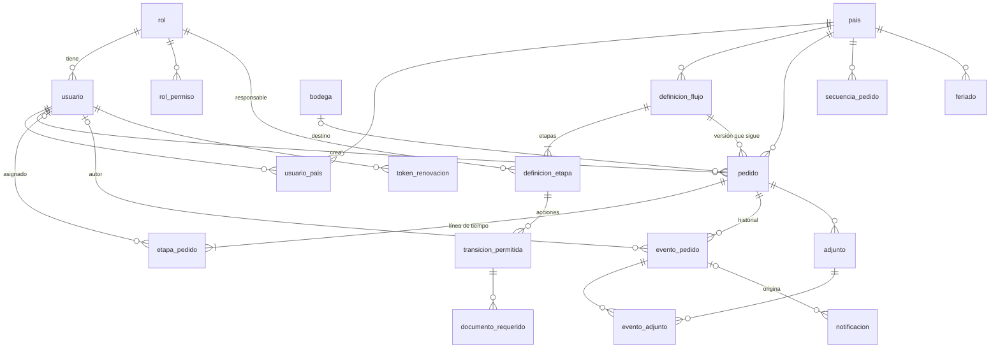

# Modelo de datos — Decokasa

**Fecha:** 2026-10-10 · **Fase 0, paso 0.9** · **Fuentes:** `documentos/requerimientos.md` (sección 4.6 y respuestas del cliente), `documentos/arquitectura.md`, `documentos/api/openapi.yaml` y `documentos/adr/`. Correspondencia con JPA revisada con la skill `ecc:jpa-patterns`.

Esquema PostgreSQL 17 para el MVP de Ecuador: 20 tablas. Es solo diseño; las migraciones Flyway se escriben en la fase 1, y este documento no contiene SQL ejecutable.

**Marcas:**
- Sin marca: requisito de `requerimientos.md`, o consecuencia directa de uno.
- **[P]**: propuesta del equipo, no aprobada.
- **⏸**: pendiente del cliente.

## 1. Decisiones generales

| Tema | Decisión | Origen |
| --- | --- | --- |
| Identificadores | `uuid` en todas las tablas de negocio, generado por la aplicación. **[P]** UUIDv7, que es ordenable por tiempo y no fragmenta los índices como un UUID aleatorio | El contrato OpenAPI usa `uuid`. La alternativa sería un `bigint` interno más un `uuid` público; es más eficiente, pero agrega un mapeo |
| Fechas y horas | `timestamptz` (se guarda en UTC); la zona `America/Guayaquil` se aplica en el dominio y en la API. Fechas sin hora: `date` | ADR-0006 |
| Textos | `text`, con `CHECK` de longitud donde el contrato fija un máximo | Recomendación de la skill `postgres-patterns` |
| Valores cerrados (estado, acción, tipo de flujo) | `text` con `CHECK (... IN (...))`, sin tipos `ENUM` de PostgreSQL | **[P]** Agregar un valor es una migración simple, y en JPA se mapea con `@Enumerated(STRING)` |
| Concurrencia | Columna `version bigint` (bloqueo optimista) en `pedido`, `usuario`, `bodega` y `secuencia_pedido` | **[P]** Respalda el error 409 `ETAPA_CAMBIO` del contrato |
| Esquema | Flyway es dueño del esquema; Hibernate solo valida (`ddl-auto=validate`) | ADR-0001 (Flyway) y skill `jpa-patterns` |
| Borrados | No hay borrado físico de pedidos, eventos ni adjuntos. Usuarios y bodegas se desactivan con `activo` / `activa` | Requisito 4.6 e invariante del historial |

## 2. Diagrama entidad-relación



## 3. Tablas

### 3.1 Usuarios, roles y países (módulo `usuarios`)

**`pais`**

| Columna | Tipo | Restricciones | Nota |
| --- | --- | --- | --- |
| `codigo` | `text` | PK, `CHECK (codigo ~ '^[A-Z]{2}$')` | EC, CO |
| `nombre` | `text` | NOT NULL | |
| `activo` | `boolean` | NOT NULL | EC verdadero; CO falso en v1 (ADR-0009) |

**`rol`**

| Columna | Tipo | Restricciones | Nota |
| --- | --- | --- | --- |
| `id` | `uuid` | PK | |
| `codigo` | `text` | NOT NULL, UNIQUE | `admin`, `asistente_compras`, `marketing`, `compras_china`, `logistica`, `asistente_china`; el admin puede crear más (requisito 4.6) |
| `nombre` | `text` | NOT NULL | |
| `creado_en` | `timestamptz` | NOT NULL | |

**`rol_permiso`** — permisos del rol. La lista exacta de permisos se define en la fase 1.

| Columna | Tipo | Restricciones |
| --- | --- | --- |
| `rol_id` | `uuid` | FK → `rol.id`, parte de la PK |
| `permiso` | `text` | parte de la PK |

Las "etapas que atiende" el rol (requisito 4.6) no se guardan aquí. Se derivan de `definicion_etapa.rol_codigo`, para no tener dos fuentes (contrato: `Rol.etapasQueAtiende`, solo lectura).

**`usuario`**

| Columna | Tipo | Restricciones | Nota |
| --- | --- | --- | --- |
| `id` | `uuid` | PK | |
| `nombre` | `text` | NOT NULL | |
| `correo` | `text` | NOT NULL | Único sin distinguir mayúsculas (índice `lower(correo)`) |
| `usuario` | `text` | NOT NULL | Nombre de usuario; único sin distinguir mayúsculas |
| `telefono` | `text` | NOT NULL | Único. **[P]** Se guarda normalizado (solo dígitos y el `+`) para que el login por teléfono funcione con o sin espacios |
| `contrasena_hash` | `text` | NOT NULL | BCrypt (ADR-0002); nunca la contraseña |
| `rol_id` | `uuid` | NOT NULL, FK → `rol.id` | Un rol por usuario, como en el contrato. ⏸ Requisito 4.6 dice "rol(es)" |
| `activo` | `boolean` | NOT NULL DEFAULT true | |
| `intentos_fallidos` | `integer` | NOT NULL DEFAULT 0, `CHECK (>= 0)` | **[P]** Bloqueo por intentos (ADR-0002) |
| `bloqueado_hasta` | `timestamptz` | NULL | **[P]** |
| `creado_en`, `actualizado_en` | `timestamptz` | NOT NULL | |
| `version` | `bigint` | NOT NULL | Bloqueo optimista |

**`usuario_pais`**: `usuario_id` (FK) y `pais_codigo` (FK); PK compuesta.

**`token_renovacion`** **[P]** (ADR-0002, renovación de JWT): `id` uuid PK; `usuario_id` FK; `token_hash` text NOT NULL UNIQUE (nunca el token en claro); `expira_en` timestamptz NOT NULL; `revocado_en` timestamptz NULL. Si no se aprueba la renovación, la tabla no se crea.

### 3.2 Definiciones de flujo versionadas (módulo `flujos`)

**`definicion_flujo`**

| Columna | Tipo | Restricciones | Nota |
| --- | --- | --- | --- |
| `id` | `uuid` | PK | |
| `pais_codigo` | `text` | NOT NULL, FK → `pais` | |
| `tipo_flujo` | `text` | NOT NULL, `CHECK (tipo_flujo IN ('A','B'))` | |
| `version` | `integer` | NOT NULL, `CHECK (version >= 1)` | |
| `vigente` | `boolean` | NOT NULL | Solo una versión vigente por país y tipo |
| `creada_en` | `timestamptz` | NOT NULL | |

- UNIQUE (`pais_codigo`, `tipo_flujo`, `version`).
- Índice único parcial (`pais_codigo`, `tipo_flujo`) `WHERE vigente`: garantiza una sola versión vigente.
- Una versión publicada no se modifica: un cambio crea una versión nueva (ADR-0004, propuesta). Los pedidos en curso siguen apuntando a la suya.

**`definicion_etapa`**

| Columna | Tipo | Restricciones | Nota |
| --- | --- | --- | --- |
| `id` | `uuid` | PK | |
| `flujo_id` | `uuid` | NOT NULL, FK → `definicion_flujo` | |
| `numero` | `smallint` | NOT NULL, `CHECK (numero BETWEEN 1 AND 30)` | A1–A11 / B1–B12 |
| `nombre` | `text` | NOT NULL | |
| `rol_codigo` | `text` | NOT NULL, FK → `rol.codigo` | Rol responsable |
| `plazo_cantidad` | `integer` | NULL, `CHECK (> 0)` | Nulo si el cliente no lo definió (⏸ Fabricación, Incidencias) |
| `plazo_tipo` | `text` | NULL, `CHECK (IN ('HORAS_HABILES','DIAS_HABILES','DIAS_CORRIDOS'))` | ⏸ Tránsito de 45 días: hábiles o corridos |
| `automatica` | `boolean` | NOT NULL DEFAULT false | Solo Fin |

- UNIQUE (`flujo_id`, `numero`).
- `CHECK ((plazo_cantidad IS NULL) = (plazo_tipo IS NULL))`.

**`transicion_permitida`** — una fila por acción permitida en una etapa (contrato: `DefinicionAccion`).

| Columna | Tipo | Restricciones | Nota |
| --- | --- | --- | --- |
| `id` | `uuid` | PK | |
| `etapa_id` | `uuid` | NOT NULL, FK → `definicion_etapa` | |
| `accion` | `text` | NOT NULL, `CHECK (IN ('ENVIAR','APROBAR','RECHAZAR','DEVOLVER_POR_ERROR','DEVOLVER_POR_PRODUCTO_NUEVO','REPORTAR_DEMORA','ELEGIR_BODEGA'))` | |
| `etapa_destino` | `smallint` | NULL | Número de la etapa destino dentro del mismo flujo; nulo si se queda (demora, elegir bodega) |
| `requiere_observacion` | `boolean` | NOT NULL | |
| `requiere_urgencia` | `boolean` | NOT NULL | Solo DEVOLVER_POR_PRODUCTO_NUEVO |
| `requiere_bodega` | `boolean` | NOT NULL | APROBAR en A9 / B10 |

UNIQUE (`etapa_id`, `accion`).

**`documento_requerido`**: `transicion_id` (FK) y `tipo_documento` (text); PK compuesta. Por ejemplo, Packing List y BL para APROBAR en A6 / B7. ⏸ Qué documentos son "todos" en Incidencias.

Los flujos A y B de Ecuador (versión 1) se cargan con migraciones, según las tablas de transiciones de `arquitectura.md` 4.2 y del contrato.

### 3.3 Pedidos y línea de tiempo (módulo `pedidos`)

**`secuencia_pedido`** **[P] ⏸** — solo existe si se aprueba el formato `DK-EC-AAAA-NNNN`.

| Columna | Tipo | Restricciones |
| --- | --- | --- |
| `pais_codigo` | `text` | FK → `pais`, parte de la PK |
| `anio` | `smallint` | parte de la PK, `CHECK (anio BETWEEN 2026 AND 2100)` |
| `ultimo_numero` | `integer` | NOT NULL, `CHECK (ultimo_numero BETWEEN 0 AND 9999)` |
| `version` | `bigint` | NOT NULL |

Ver la sección 5 sobre cómo se numera.

**`pedido`**

| Columna | Tipo | Restricciones | Nota |
| --- | --- | --- | --- |
| `id` | `uuid` | PK | |
| `numero` | `text` | NOT NULL, UNIQUE | Requisito 4.2 #5: único y no se reutiliza. ⏸ Formato |
| `pais_codigo` | `text` | NOT NULL, FK → `pais` | No cambia (invariante) |
| `tipo_flujo` | `text` | NOT NULL, `CHECK (IN ('A','B'))` | No cambia |
| `flujo_id` | `uuid` | NOT NULL, FK → `definicion_flujo` | Versión del flujo que sigue el pedido |
| `nombre` | `text` | NOT NULL, `CHECK (char_length(nombre) BETWEEN 1 AND 200)` | |
| `descripcion` | `text` | NULL, `CHECK (char_length(descripcion) <= 4000)` | |
| `incluye_productos_nuevos` | `boolean` | NOT NULL DEFAULT false | Solo flujo A (requisito 4.2 #6) |
| `creado_por` | `uuid` | NOT NULL, FK → `usuario` | |
| `creado_en` | `timestamptz` | NOT NULL | |
| `etapa_actual` | `smallint` | NOT NULL | Copia de la etapa en estado ACTUAL, para listar y filtrar sin unir tablas |
| `finalizado` | `boolean` | NOT NULL DEFAULT false | |
| `finalizado_en` | `timestamptz` | NULL | |
| `bodega_id` | `uuid` | NULL, FK → `bodega` | Elegida en A9 / B10 |
| `urgencia_nivel` | `text` | NULL, `CHECK (IN ('URGENTE','PRIORITARIO','NORMAL'))` | Urgencia activa (requisito 4.2 #11) |
| `urgencia_activada_en` | `timestamptz` | NULL | |
| `urgencia_vence_en` | `timestamptz` | NULL | Vencimiento propio, hasta volver a A4 / B5 |
| `demora_motivo` | `text` | NULL | Última demora en aduana |
| `demora_nueva_fecha_llegada` | `date` | NULL | ⏸ La escribe David o la calcula el sistema |
| `demora_reportada_por` | `uuid` | NULL, FK → `usuario` | |
| `demora_reportada_en` | `timestamptz` | NULL | |
| `actualizado_en` | `timestamptz` | NOT NULL | |
| `version` | `bigint` | NOT NULL | Bloqueo optimista |

Restricciones adicionales:
- `CHECK` de urgencia completa: las tres columnas de urgencia son nulas a la vez o tienen valor a la vez.
- `CHECK` de demora completa: igual con las cuatro columnas de demora.
- `CHECK (finalizado = (finalizado_en IS NOT NULL))`.
- Que país y tipo de flujo no cambien lo garantiza el dominio. **[P]** Además, un trigger `BEFORE UPDATE` que rechace cambios en `pais_codigo`, `tipo_flujo` y `flujo_id`.

**`etapa_pedido`** — una fila por etapa del flujo y por pedido; es la línea de tiempo.

| Columna | Tipo | Restricciones | Nota |
| --- | --- | --- | --- |
| `id` | `uuid` | PK | |
| `pedido_id` | `uuid` | NOT NULL, FK → `pedido` | |
| `numero` | `smallint` | NOT NULL | |
| `estado` | `text` | NOT NULL, `CHECK (IN ('PENDIENTE','ACTUAL','COMPLETADA','DEVUELTA'))` | |
| `asignado_a` | `uuid` | NULL, FK → `usuario` | Reasignación por el admin. ⏸ Si puede ser de otro rol |
| `entrada_en` | `timestamptz` | NULL | Última entrada; el plazo se reinicia en cada reentrada |
| `salida_en` | `timestamptz` | NULL | |
| `vence_en` | `timestamptz` | NULL | Calculado en días u horas hábiles por el dominio (ADR-0006) |
| `reentradas` | `integer` | NOT NULL DEFAULT 0, `CHECK (>= 0)` | |
| `motivo_retraso` | `text` | NULL | Requisito 4.2 #16 |
| `fecha_planificada` | `date` | NULL | Cronograma contra la meta |
| `movida_al_lunes` | `boolean` | NOT NULL DEFAULT false | |

Restricciones adicionales:
- UNIQUE (`pedido_id`, `numero`).
- Índice único parcial (`pedido_id`) `WHERE estado = 'ACTUAL'`: un pedido tiene una sola etapa activa (invariante).

### 3.4 Historial de solo inserción (módulo `historial`)

**`evento_pedido`**

| Columna | Tipo | Restricciones | Nota |
| --- | --- | --- | --- |
| `id` | `uuid` | PK | |
| `pedido_id` | `uuid` | NOT NULL, FK → `pedido` | |
| `etapa` | `smallint` | NOT NULL | |
| `tipo` | `text` | NOT NULL, `CHECK (IN ('PEDIDO_CREADO','ETAPA_ENVIADA','ETAPA_APROBADA','ETAPA_RECHAZADA','PEDIDO_DEVUELTO','DEMORA_REPORTADA','BODEGA_ASIGNADA','OBSERVACION_AGREGADA','ARCHIVO_SUBIDO','ETAPA_REASIGNADA','PLAZO_VENCIDO','PEDIDO_FINALIZADO'))` | Mismos valores que el contrato |
| `usuario_id` | `uuid` | NULL, FK → `usuario` | Nulo en los eventos del sistema |
| `rol_codigo` | `text` | NULL | Rol del usuario en ese momento; queda aunque luego cambie de rol |
| `ocurrido_en` | `timestamptz` | NOT NULL | Hora del servidor (R5) |
| `observacion` | `text` | NULL, `CHECK (char_length(observacion) <= 4000)` | |
| `nivel_urgencia` | `text` | NULL | |
| `datos` | `jsonb` | NULL | **[P]** Detalle adicional según el tipo: etapa de destino, fecha de demora, bodega |

**`evento_adjunto`**: `evento_id` (FK) y `adjunto_id` (FK); PK compuesta. Liga cada archivo con el evento en que se subió; en el demo faltaba (`auditoria-demo.md`, 2.3).

**Cómo se garantiza el solo inserción (R7):**
1. El usuario de base de datos de la aplicación tiene solo `INSERT` y `SELECT` sobre `evento_pedido` y `evento_adjunto` (`REVOKE UPDATE, DELETE`).
2. **[P]** Un trigger `BEFORE UPDATE OR DELETE` que lanza un error, como segunda barrera aunque se usen otras credenciales.
3. En JPA, la entidad es inmutable (sección 7).
4. Las FK desde `evento_pedido` usan `ON DELETE RESTRICT`, así que no se puede borrar un pedido con historial.

### 3.5 Archivos (módulo `archivos`)

**`adjunto`**

| Columna | Tipo | Restricciones | Nota |
| --- | --- | --- | --- |
| `id` | `uuid` | PK | |
| `pedido_id` | `uuid` | NOT NULL, FK → `pedido` | |
| `etapa` | `smallint` | NOT NULL | |
| `nombre` | `text` | NOT NULL | Nombre original; nunca se usa sin codificar en enlaces |
| `tipo_documento` | `text` | NOT NULL | Por ejemplo, "Packing List" |
| `tipo_mime` | `text` | NOT NULL | ⏸ Formatos aceptados |
| `tamano_bytes` | `bigint` | NOT NULL, `CHECK (tamano_bytes BETWEEN 1 AND 104857600)` | 100 MB (requisito 4.2 #15) |
| `ruta_temporal` | `text` | NULL | Mientras no se copia a Drive |
| `drive_id` | `text` | NULL | Id que entrega Drive |
| `estado_copia` | `text` | NOT NULL, `CHECK (IN ('PENDIENTE','COPIADO','FALLIDO'))` | |
| `intentos` | `integer` | NOT NULL DEFAULT 0 | |
| `ultimo_error` | `text` | NULL | |
| `subido_por` | `uuid` | NOT NULL, FK → `usuario` | |
| `subido_en` | `timestamptz` | NOT NULL | |
| `copiado_en` | `timestamptz` | NULL | |

`CHECK ((estado_copia = 'COPIADO') = (drive_id IS NOT NULL))`. El archivo en sí no se guarda en la base (ADR-0003).

### 3.6 Notificaciones (módulo `notificaciones`)

**`notificacion`** — cola de salida (outbox, ADR-0012 **[P]**) y registro de correos.

| Columna | Tipo | Restricciones | Nota |
| --- | --- | --- | --- |
| `id` | `uuid` | PK | |
| `pedido_id` | `uuid` | NULL, FK → `pedido` | |
| `evento_id` | `uuid` | NULL, FK → `evento_pedido` | Evento que la originó |
| `destinatario` | `text` | NOT NULL | ⏸ Solo el admin o también el responsable (ADR-0005) |
| `plantilla` | `text` | NOT NULL | |
| `datos` | `jsonb` | NOT NULL | Variables de la plantilla |
| `estado` | `text` | NOT NULL, `CHECK (IN ('PENDIENTE','ENVIADA','FALLIDA'))` | |
| `intentos` | `integer` | NOT NULL DEFAULT 0 | |
| `proximo_intento_en` | `timestamptz` | NULL | |
| `ultimo_error` | `text` | NULL | |
| `creada_en` | `timestamptz` | NOT NULL | |
| `enviada_en` | `timestamptz` | NULL | |

La tarea de envío toma lotes con `SELECT … FOR UPDATE SKIP LOCKED`, así dos procesos no envían el mismo correo.

### 3.7 Bodegas y plazos (módulos `bodegas` y `plazos`)

**`bodega`**: `id` uuid PK; `nombre` text NOT NULL; `ciudad` text NOT NULL; `activa` boolean NOT NULL DEFAULT true; `creada_en` timestamptz; `version` bigint. Índice único `lower(nombre)`. Carga inicial: Quito, Guayaquil e Ibarra.

**`configuracion_plazos`**: una sola fila (`id smallint PK CHECK (id = 1)`); `meta_dias` integer NOT NULL `CHECK (> 0)`; `actualizado_en`; `actualizado_por` FK → `usuario`. ⏸ Valor provisional 90.

**`feriado`** **[P] ⏸** (Could en el PRD): `pais_codigo` FK y `fecha` date, como PK compuesta; `descripcion` text NOT NULL. Solo se usa si el cliente aprueba descontar feriados.

## 4. Índices

| Índice | Tabla | Para qué |
| --- | --- | --- |
| UNIQUE (`numero`) | `pedido` | Búsqueda exacta por número (`/pedidos/buscar`) |
| GIN `gin_trgm_ops` sobre `numero` y `nombre` **[P]** | `pedido` | Filtro `texto` del listado (búsqueda parcial). Requiere la extensión `pg_trgm`. Alternativa sin extensión: `lower(nombre) LIKE`, aceptable con pocos pedidos |
| (`tipo_flujo`, `etapa_actual`) `WHERE NOT finalizado` | `pedido` | Listado y bandeja por etapa |
| (`creado_en DESC`) | `pedido` | Orden por defecto del listado |
| (`vence_en`) `WHERE estado = 'ACTUAL'` | `etapa_pedido` | **Etapas vencidas:** `WHERE estado = 'ACTUAL' AND vence_en < now()`, para la tarea de vencimientos y `/pedidos/vencidos` |
| (`asignado_a`) `WHERE estado = 'ACTUAL'` | `etapa_pedido` | Bandeja del usuario asignado |
| UNIQUE (`pedido_id`) `WHERE estado = 'ACTUAL'` | `etapa_pedido` | Invariante de una sola etapa activa |
| (`urgencia_vence_en`) `WHERE urgencia_nivel IS NOT NULL` | `pedido` | Urgencias vencidas |
| (`pedido_id`, `ocurrido_en DESC`) | `evento_pedido` | Historial del pedido |
| (`ocurrido_en`) | `evento_pedido` | Auditoría global por fechas. **[P]** BRIN si la tabla crece mucho |
| (`usuario_id`, `ocurrido_en`) | `evento_pedido` | Auditoría por usuario |
| (`pedido_id`, `etapa`) | `adjunto` | Archivos de una etapa y revisión de documentos obligatorios |
| (`subido_en`) `WHERE estado_copia IN ('PENDIENTE','FALLIDO')` | `adjunto` | Reintentos y copias fallidas |
| (`proximo_intento_en`) `WHERE estado = 'PENDIENTE'` | `notificacion` | Cola de envío |
| UNIQUE `lower(correo)`, `lower(usuario)`, `telefono` | `usuario` | Login por cualquiera de los tres |
| Índice en cada FK que no esté cubierto por otro índice | todas | Evita recorridos completos al unir y al validar FK |

Consulta de etapas vencidas, como referencia; la escribirá el adaptador de `pedidos` que implementa `PedidosConEtapaActiva`:

```sql
SELECT p.id, p.numero, e.numero AS etapa, e.vence_en, e.asignado_a, e.motivo_retraso
FROM etapa_pedido e
JOIN pedido p ON p.id = e.pedido_id
WHERE e.estado = 'ACTUAL'
  AND e.vence_en < now()
ORDER BY e.vence_en;
```

## 5. Numeración `DK-EC-AAAA-NNNN` **[P] ⏸**

**Estado: propuesta pendiente de aprobación del cliente.** El requisito 4.2 #5 solo pide que el número sea secuencial, único y que no se reutilice. El cliente pidió "uno diferente y más profesional", y `DK-EC-AAAA-NNNN` es la propuesta del equipo; todavía no tiene respuesta.

Cómo funcionaría:
1. Dentro de la transacción que crea el pedido, se bloquea la fila (`pais_codigo`, `anio`) de `secuencia_pedido`, o se crea si es la primera del año, y se incrementa `ultimo_numero`.
2. Se arma `DK-{pais}-{anio}-{numero con 4 dígitos}`. El año sale del reloj del servidor en hora de Ecuador (R5).
3. Si la transacción falla, el incremento se revierte con ella. A diferencia de una `SEQUENCE` de PostgreSQL, que no se revierte, así no quedan huecos.
4. `UNIQUE (numero)` en `pedido` es la última barrera.

**Límite:** 9 999 pedidos por país y año.

**Alternativa si el formato no se aprueba:** una `SEQUENCE` global con el formato que elija el cliente. `NumeroPedido` y `GeneradorNumeroPedido` (`arquitectura.md`, 4.3) aíslan el cambio, y la tabla `secuencia_pedido` dejaría de ser necesaria.

## 6. Decisiones pendientes que afectan al modelo

| Pendiente | Tablas afectadas | Cómo queda el modelo hasta que se decida |
| --- | --- | --- |
| Formato del número de pedido | `secuencia_pedido`, `pedido.numero` | `numero` es `text` sin formato fijo |
| ¿Un usuario puede tener varios roles? ("rol(es)" en 4.6) | `usuario.rol_id` | Un rol, como el contrato; pasar a una tabla `usuario_rol` sería una migración aditiva |
| Plazos de Fabricación e Incidencias; tránsito hábil o corrido | `definicion_etapa.plazo_*` | Columnas nulas o configurables por etapa |
| Urgencias en horas hábiles o corridas | `definicion_etapa`, `pedido.urgencia_vence_en` | El tipo de plazo se configura por etapa |
| Rechazo en Revisión durante una urgencia | `pedido.urgencia_*` | El modelo guarda la urgencia; la regla vive en el dominio |
| Feriados | `feriado` | La tabla solo se crea si se aprueba |
| Destinatarios de las alertas | `notificacion.destinatario` | Una fila por destinatario, sirve para los dos casos |
| Formatos de archivo | `adjunto.tipo_mime` | Se valida en el dominio, sin `CHECK` fijo |
| Recálculo en aduana | `pedido.demora_nueva_fecha_llegada` | La columna sirve para los dos casos |
| Documentos de Incidencias | `documento_requerido` | Se cargan cuando el cliente los defina |
| Reasignar a otro rol | `etapa_pedido.asignado_a` | FK a cualquier usuario; la regla vive en el dominio |
| Pausar o cancelar, checklist por etapa | — | Sin tablas hasta que se aprueben |

## 7. Correspondencia con la persistencia del backend (JPA)

Revisado con `ecc:jpa-patterns` y con las reglas de `arquitectura.md` (R1 a R3).

| Regla | Cómo se aplica |
| --- | --- |
| JPA fuera del dominio | Las entidades JPA (`PedidoEntity`, `EtapaPedidoEntity`, `EventoPedidoEntity`, …) viven solo en `<modulo>/adapter/out/persistence/`. Un mapeador convierte cada entidad en un objeto de dominio y al revés. El dominio no tiene anotaciones `@Entity`, `@Id` ni `@Column` (R1, R3) |
| Identificadores | `@Id UUID id`, asignado por la aplicación, sin `@GeneratedValue` |
| Valores cerrados | `@Enumerated(EnumType.STRING)` sobre enums del adaptador que corresponden a los `CHECK` |
| Bloqueo optimista | `@Version Long version` en `PedidoEntity`, `UsuarioEntity`, `BodegaEntity` y `SecuenciaPedidoEntity`. La excepción de bloqueo optimista se traduce a un error de dominio y luego a 409 `ETAPA_CAMBIO` |
| Historial inmutable | `EventoPedidoEntity` con `@org.hibernate.annotations.Immutable`, columnas `updatable = false` y sin setters. El repositorio solo expone guardar y consultar |
| Relaciones | `@ManyToOne(fetch = LAZY)` hacia `usuario`, `bodega` y `definicion_flujo`. `PedidoEntity` → `EtapaPedidoEntity` con `@OneToMany(mappedBy, cascade = ALL, orphanRemoval = true)`, porque las etapas son parte del agregado. Nunca `EAGER` en colecciones |
| N+1 | El detalle del pedido usa `JOIN FETCH` de sus etapas. Los listados y la bandeja usan proyecciones (interfaces o DTO), no entidades completas |
| `jsonb` | Mapeo nativo de Hibernate 6 (`@JdbcTypeCode(SqlTypes.JSON)`) en `evento_pedido.datos` y `notificacion.datos` |
| Paginación | `Pageable` en los repositorios, con el orden por defecto `creado_en DESC`. Coincide con `pagina` y `tamano` del contrato |
| Cola de correos | Consulta nativa con `FOR UPDATE SKIP LOCKED` en el adaptador de `notificaciones` |
| Esquema | `spring.jpa.hibernate.ddl-auto=validate`; Flyway crea y migra. `spring.jpa.open-in-view=false` |
| Pruebas | `@DataJpaTest` con Testcontainers (PostgreSQL 17) para repositorios, migraciones, la secuencia del número y los triggers de solo inserción |

**Diferencia con la skill `jpa-patterns`:** la skill pone `@Transactional` en los métodos de servicio. En este proyecto los casos de uso no llevan anotaciones de Spring (R2); la transacción la abre el adaptador de entrada o un decorador en `config/` (ADR-0012, propuesta). Si el ADR-0012 no se aprueba, habría que revisar R2.

## 8. Siguientes pasos

- **Paso 0.10:** el diagrama ER de la sección 2 pasa a `documentos/diagramas/`.
- **Fase 1:** migración V1 con `pais`, `rol`, `rol_permiso`, `usuario`, `usuario_pais` y, si se aprueba, `token_renovacion`.
- **Fase 2:** migración V2 con flujos, pedidos, etapas, eventos y la secuencia.
- **Fases 3 y 4:** adjuntos, notificaciones y bodegas.
