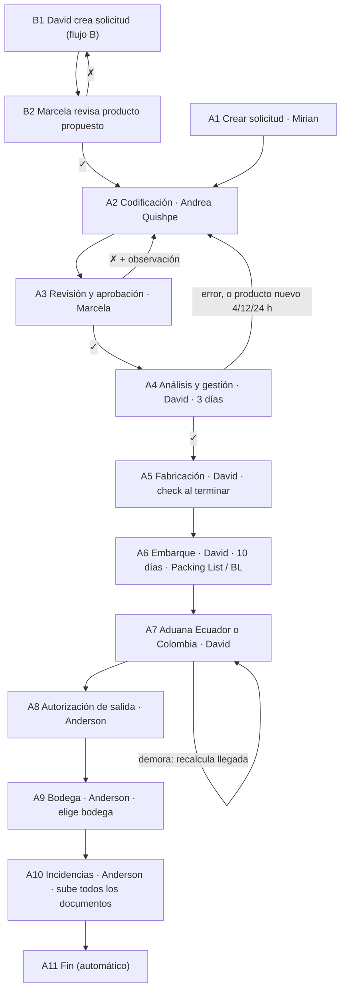

# Decokasa — Levantamiento de requerimientos

Oct 9, 2026 · @Richard

## 1. Lo que dice el documento del cliente

DECOKASA S.A.S. pide un sistema web que controle cada pedido de importación, desde la solicitud hasta la bodega. El sistema asigna un responsable a cada etapa, fija tiempos máximos y avisa por Gmail. Esta sección resume el archivo `Latinoamérica.docx` sin omitir nada; los errores y contradicciones del original se marcan *(sic)* y se tratan en la sección 5.

### 1.1 Objetivo (texto del cliente)

> Establecer un procedimiento claro, ordenado y verificable para la solicitud, revisión, corrección, aprobación e inicio de fabricación de mercadería solicitada por DECOKASA S.A.S. definiendo las responsabilidades de cada persona involucrada y los tiempos máximos para cada actividad.

### 1.2 Responsables

| Persona | Rol | Ubicación | Etapas a cargo |
| --- | --- | --- | --- |
| Mirian Franco | Admin, control de todo el sistema | Ecuador | Crear solicitud (flujo producto existente); agrega usuarios y roles |
| Marcela Catucumba / Catucuamba *(sic)* | Asistente de compras | Ecuador | Revisión y aprobación; revisión de productos propuestos |
| Andrea Quishpe | Marketing | Ecuador | Codificación |
| David Tulcan / Túlcan | Compras China | China | Análisis y gestión, fabricación, embarque, aduana; crea solicitud en flujo producto nuevo |
| Anderzon / Anderson Enriquez *(sic)* | Logística | Ecuador | Autorización de salida, bodega |
| Andrea Collaguazo | Asistente de compras en China | China | No aparece en ninguna etapa |

### 1.3 Reglas generales

- Mirian puede agregar usuarios y roles. Otra persona con rol admin también puede crear solicitudes.
- Cada usuario entra con correo, usuario o número de teléfono, más contraseña. El panel muestra el dashboard de su rol.
- El sistema es para Ecuador y Colombia, con procesos distintos. Al iniciar sesión, la admin elige el país. Se implementa primero en Ecuador.
- El sistema se conecta a la API de Claude (el documento no dice para qué).
- Al buscar un pedido se ve el flujo completo con la etapa actual marcada, y un resumen de lo ocurrido en cada etapa anterior.
- El número de pedido se genera en secuencia y sirve para rastrear el pedido.
- Los documentos subidos se guardan en Google Drive.
- En cada etapa el sistema notifica por Gmail al responsable.
- Cada etapa tiene un check, carga de archivos y un cuadro de observaciones.
- Al crear la solicitud se elige si es un producto nuevo pedido por Ecuador o un producto existente.
- Pendiente del cliente: "subir el formato y plantilla de solicitud de pedido".

### 1.4 Flujo A — producto existente (11 etapas; el texto dice "10" *(sic)*)

1. **Crear solicitud de pedido** — Mirian Franco (o un admin). Usa el formato establecido y sube el documento. Se genera el número de pedido.
2. **Codificación** — Andrea Quishpe. Revisa la solicitud: cantidades y etiquetas correctas; modelos, medidas, colores y especificaciones detallados; sin campos vacíos dentro del documento. Sube los documentos.
3. **Revisión y aprobación** — Marcela. Ve los documentos de Andrea y aprueba (✓) o desaprueba (✗) con observaciones. Si desaprueba, vuelve a la etapa 2.
4. **Análisis y gestión** — David. Tiene 3 días para leer y analizar. Si hay errores, devuelve a la etapa 2. Si China propone productos nuevos no codificados, también vuelven a la etapa 2 con urgencia: Urgente 4 h, Prioritario 12 h, Normal 24 h. Cada devolución lleva observaciones y archivos extra. Si todo está bien, da check aprobado.
5. **Fabricación** — David. Sin más detalle.
6. **Embarque** — David. Tiene 10 días para buscar navieras y embarcar. Gestiona Packing List / BL, sube archivos con observaciones y da check al enviar.
7. **Aduana Ecuador o Aduana Colombia** — David da check cuando llega la mercadería. Si se demora, sube una observación para recalcular la llegada.
8. **Autorización de salida** — Anderson autoriza la salida de aduana con check.
9. **Bodega** — Anderson elige la bodega de destino (Quito, Guayaquil, Ibarra… n bodegas), da check y sube observaciones y documentos.
10. **Incidencias** — Se suben todos los archivos y se da check. El documento pregunta: "¿Quién sube todos los documentos?"
11. **Fin.**

### 1.5 Flujo B — producto nuevo propuesto por China (12 etapas)

1. **Crear solicitud de pedido** — David crea la solicitud con el formato establecido y sube el producto nuevo que propone.
2. **Revisión de productos propuestos** — Marcela da check o devuelve a la etapa 1 con observación.
3. **Codificación** — Andrea Quishpe, con las mismas validaciones del flujo A.
4. **Revisión y aprobación** — Marcela. Si desaprueba, vuelve a la etapa 3.
5. **Análisis y gestión** — David, 3 días. Los errores vuelven a la "etapa 2 (Codificación)" *(sic: Codificación es la 3)*. Los productos nuevos vuelven a la etapa 3 con urgencia de 4 h, 12 h o 24 h.
6. **Fabricación** — David.
7. **Embarque** — David, 10 días, Packing List / BL.
8. **Aduana Ecuador o Colombia** — David.
9. **Autorización de salida** — Anderson.
10. **Bodega** — Anderson.
11. **Incidencias** — Misma pregunta abierta.
12. **Fin.**

### 1.6 Stack técnico propuesto

| Capa | Recomendado | Por qué |
| --- | --- | --- |
| Frontend | React 19 + TypeScript + Vite | Reutiliza la demo de AI Studio |
| Estilos y componentes | Tailwind CSS 4 + shadcn/ui + lucide-react | Componentes accesibles con colores de la marca |
| Estado y datos | TanStack Query + React Router + React Hook Form + Zod | Caché de API, rutas protegidas, validación |
| Backend | Spring Boot 3.x, Java 21 LTS | Reglas de negocio, seguridad, tareas programadas |
| Acceso a datos | Spring Data JPA (Hibernate) + Flyway | Migraciones versionadas |
| Base de datos | PostgreSQL 16 o 17 en Docker | Relacional, transaccional, apta para auditoría |
| Seguridad | Spring Security + JWT + BCrypt | Login propio con roles, sin depender de Google |
| Tiempo real | WebSocket (STOMP) de Spring | Los checks se ven al instante |
| Archivos | Google Drive | Archivos de hasta 100 MB fuera de la base de datos |
| Google Drive | Drive API desde el servidor con cuenta de servicio | Copia en segundo plano; China nunca toca Google |
| Documentación de API | springdoc-openapi (Swagger UI) | Contrato siempre actualizado |
| Contenedores | Docker + Docker Compose | Mismo entorno en desarrollo, pruebas y producción |

### 1.7 Herramientas de trabajo

| Para qué | Herramienta | Alternativa |
| --- | --- | --- |
| Scrum, historias, sprints | Jira Software (gratis hasta 10 usuarios) | GitHub Projects, Trello |
| Código y versiones | Git + GitHub privado | GitLab |
| Integración continua | GitHub Actions | GitLab CI |
| Diseño de pantallas | Figma / FigJam | Penpot |
| Diagramas | Mermaid en el repo + draw.io | Excalidraw, PlantUML |
| Editor | VS Code | — |
| Pruebas de API | Postman | Swagger UI |
| Cliente de BD | pgAdmin 4 | Azure Data Studio |

La tabla de servicios de producción (servidor, dominio y HTTPS, archivos, correo de alertas, monitoreo, disponibilidad, respaldos, calidad de código) está vacía en el original: "mirar al final".

### 1.8 Calculadora de cronograma existente

El cliente ya usa una app que calcula el cronograma de un pedido, y pide analizar por qué la web debe hacer lo mismo. A partir de la fecha de pedido genera tres cosas: las fechas de 6 etapas encadenadas; el total de días contra una meta de 90; y dos textos para copiar (fechas para la columna "Fecha planificada" de la plantilla y cinco comandos `/remind` de Slack).

Cada etapa suma N días calendario a la anterior. Si cae en fin de semana, pasa al lunes.

| Etapa | + días | Resultado (ejemplo) | Ajuste |
| --- | --- | --- | --- |
| 1. Pedido | — | Vie 09/10/2026 | — |
| 2. Revisión | 3 | Lun 12/10/2026 | ninguno |
| 3. Inicio de fabricación | 8 | Mar 20/10/2026 | ninguno |
| 4. Fin de fabricación | 31 | Vie 20/11/2026 | ninguno |
| 5. Embarque | 12 | Mié 02/12/2026 | ninguno |
| 6. Llegada a Ecuador | 45 | Lun 18/01/2027 | +2 días (caía sáb 16/01) |

Las duraciones suman 99 días; con el ajuste el total mostrado es 101. Los recordatorios son la fecha de cada etapa menos 3 días a las 9:00; si cae en fin de semana, se adelantan al viernes.

Hallazgos del cliente sobre esa app:

- La meta de 90 días es inalcanzable: las duraciones suman 99.
- "Siempre en día laboral" confunde: los días son corridos y solo la fecha final se mueve.
- El ajuste de fin de semana infla el total (101 en vez de 99), y un barco llega cualquier día.
- El canal de Slack es genérico (`#imp2026-00X-producto`) y no existe.
- El primer recordatorio cae el mismo día del pedido; si ya pasaron las 9:00, Slack lo rechaza.
- "Copiar" copia los cinco comandos juntos, pero Slack exige enviarlos uno por uno.

Lo que el cliente no pudo comprobar: si considera feriados de Ecuador o China (el Año Nuevo chino es el mayor riesgo), si un ajuste intermedio arrastra a las etapas siguientes, y si "Cambiar fecha" recalcula las etapas posteriores.

## 2. PRD — Sistema de seguimiento de pedidos de importación (plan-prd)

El producto es un flujo de trabajo por etapas, con responsables, plazos, evidencias y alertas, que reemplaza la coordinación manual entre Ecuador y China. Esta sección dice *qué* debe cumplirse y *por qué*; el *cómo* está en la sección 3. Donde el documento no da el dato, se escribe **TBD** con el método para validarlo.

### Problema

Compras, marketing y logística de DECOKASA coordinan cada pedido entre Ecuador y China sin un registro único. No se sabe en qué etapa está un pedido, quién lo tiene ni si venció su plazo. Los errores de codificación detectados tarde obligan a devolver documentos y alargan el ciclo, que hoy ya supera la meta: 99 días contra 90.

### Evidencia

- El cliente ya usa una calculadora de cronograma con recordatorios manuales en Slack. Tiene errores conocidos: canal inexistente, recordatorios rechazados y comandos que se copian juntos.
- Los tiempos estándar suman 99 días contra una meta de 90 (dato del documento).
- El documento define devoluciones frecuentes: Revisión → Codificación y China → Codificación.
- Cuántos pedidos hay al mes, cuántos se devuelven y cuántos se atrasan: **TBD — validar con datos históricos de compras**.

### Usuarios

- **Primarios**: los 6 responsables nombrados (Admin, Compras China, Asistente de compras, Marketing/codificación, Logística, Asistente de compras en China), más otros usuarios con rol admin.
- **Disparador**: un pedido entra en la etapa de esa persona, o vence su plazo.
- **Ubicación**: David en China, el resto en Ecuador. El sistema debe funcionar desde China sin depender de servicios de Google en el cliente.
- **No es para**: proveedores, navieras ni clientes finales; ninguno aparece como usuario en el documento (**TBD — confirmar con el cliente**). Colombia queda fuera en la primera versión.

### Hipótesis

Creemos que un **flujo de pedidos por etapas con responsables, plazos, checks, evidencias y alertas por Gmail** reducirá **los atrasos y las devoluciones** para **el equipo de compras y logística de DECOKASA Ecuador**. Sabremos que acertamos cuando **el tiempo de pedido a llegada baje de 99 días a la meta que fije el cliente** y **el 100 % de los pedidos tenga su historial en el sistema**.

### Métricas de éxito

| Métrica | Meta | Cómo se mide |
| --- | --- | --- |
| Días de pedido a llegada | Meta configurable: hoy 90 contra 99 planificados; el cliente la ajustará | Fecha de check de Aduana menos fecha de creación |
| Codificación y Revisión dentro de plazo | 100 % en ≤ 24 h hábiles cada una; con urgencia, 4 / 12 / 24 h hasta llegar a Análisis | Tiempo entre entrada y salida de cada etapa |
| Análisis dentro de plazo | 100 % en ≤ 3 días hábiles | Tiempo entre entrada y check de la etapa |
| Embarque dentro de plazo | 100 % en ≤ 10 días hábiles | Tiempo entre entrada y check de la etapa |
| Salida y Bodega dentro de plazo | 100 % en ≤ 24 h hábiles cada una | Tiempo entre entrada y check de cada etapa |
| Devoluciones a Codificación por pedido | **TBD** (sin línea base) | Conteo de devoluciones en el historial |
| Pedidos con historial completo | 100 % | Pedidos con check y evidencia en cada etapa |

### Alcance

**MVP (Ecuador)**: login por rol, gestión de usuarios y roles, creación de pedidos con número secuencial, los flujos A (pedido de Ecuador, con productos existentes y nuevos) y B (pedido propuesto por China) con todas sus etapas, check ✓/✗, observaciones, archivos en Google Drive, devoluciones con urgencia, plazos visibles, alertas por Gmail al admin, búsqueda de pedido, y dashboard por rol con la línea de tiempo horizontal de cada pedido.

**Fuera de alcance en la primera versión**

- Proceso de Colombia — se verá más adelante; entonces elegirán país el admin y los usuarios. El modelo lo permite desde el inicio.
- Recordatorios por Slack — la web reemplaza la calculadora actual y sus recordatorios.
- API de Claude — se implementará más adelante.
- App móvil — solo web.
- Validar el contenido de los documentos — solo se suben; cada usuario responde por lo que sube.
- Seguimiento producto por producto — el detalle va en los archivos; el sistema sigue el estado del pedido.
- Portal para proveedores o navieras — no se menciona.

### Hitos de entrega

| # | Hito | Resultado visible | Estado |
| --- | --- | --- | --- |
| 1 | Acceso y usuarios | Cada persona entra y ve su dashboard; Mirian gestiona usuarios y roles | pendiente |
| 2 | Pedido y Codificación | Se crea un pedido numerado, se codifica y se revisa con ✓/✗ y devoluciones | pendiente |
| 3 | China: análisis, fabricación y embarque | David analiza en 3 días, devuelve con urgencia y registra embarque en 10 días | pendiente |
| 4 | Aduana, salida y bodega | Logística autoriza la salida y elige la bodega | pendiente |
| 5 | Seguimiento y alertas | Búsqueda con línea de tiempo, alertas por Gmail y cronograma contra la meta de 90 días | pendiente |
| 6 | Flujo B (pedido propuesto por China) | David crea los pedidos que propone desde China (11 etapas + Fin automático) | pendiente |
| 7 | Colombia | Selección de país y proceso colombiano | pendiente (fase 2) |

### Riesgos

| Riesgo | Probabilidad | Impacto | Mitigación |
| --- | --- | --- | --- |
| Acceso a Google (Drive, Gmail) bloqueado en China | Alta | Alto | El servidor sube a Drive con cuenta de servicio; David solo usa la web (lo propone el documento) |
| Alertas solo al admin: el responsable no se entera a tiempo | Media | Alto | Bandeja y línea de tiempo en cada dashboard; confirmar si el responsable también recibe correo |
| Meta de 90 días inalcanzable con los tiempos actuales | Alta | Medio | Meta y plazos configurables; el cliente los ajustará |
| Documentos sin validación del sistema | Media | Medio | La revisión de Marcela es el control; cada usuario responde por lo que sube |
| Feriados de Ecuador y China (Año Nuevo chino) sin definir | Media | Medio | Calendario de feriados configurable |
| Un solo responsable por etapa | Media | Medio | El admin puede actuar en cualquier etapa o reasignarla (confirmado) |

Las respuestas del cliente y lo que falta confirmar están en la sección 5.

*Estado: BORRADOR — solo requerimientos. Falta la planificación de implementación.*

## 3. PRD de implementación (prp-prd)

Se propone una web interna con flujos configurables por país y por tipo de producto, construida con el stack que eligió el cliente (sección 1.6). Se entrega en 7 fases; la primera es base técnica y acceso. No se hizo estudio de mercado ni hay código previo: el repositorio está vacío desde el commit `4a9f0e2`.

### Solución propuesta

Una aplicación web donde cada pedido avanza por etapas. En cada etapa el responsable revisa, sube evidencias, escribe observaciones y aprueba, rechaza o devuelve. El servidor guarda cada transición como historial auditable, copia los archivos a Google Drive, envía alertas por Gmail y mide plazos contra el SLA de la etapa. Se eligió un flujo configurable (no fijo en código) porque ya hay dos variantes (A y B) y viene un segundo país.

### Trabajos por hacer (JTBD) por rol

| Rol | Cuando… | quiero… | para… |
| --- | --- | --- | --- |
| Admin (Mirian) | llega una necesidad de mercadería | crear la solicitud con la plantilla y obtener un número | rastrear el pedido de punta a punta |
| Marketing (Andrea Q.) | me llega una solicitud o devolución | ver qué falta y su urgencia | codificar sin errores y a tiempo |
| Asistente de compras (Marcela) | Andrea sube la codificación | aprobar o rechazar con observaciones | que a China solo llegue información correcta |
| Compras China (David) | recibo documentos aprobados | analizarlos en 3 días y devolver o proponer productos | fabricar y embarcar sin errores |
| Logística (Anderson) | la mercadería llega a aduana | autorizar la salida y elegir bodega | que llegue al lugar correcto |
| Cualquiera | me preguntan por un pedido | buscarlo y ver su línea de tiempo | responder sin perseguir a nadie |

### Capacidades (MoSCoW)

| Prioridad | Capacidad | Razón |
| --- | --- | --- |
| Must | Login con correo, usuario o teléfono + contraseña; dashboard por rol | Pedido explícito |
| Must | Gestión de usuarios y roles por el admin; el admin actúa o reasigna en cualquier etapa | Pedido explícito; confirmado |
| Must | Pedido con número secuencial con formato profesional (propuesta: `DK-EC-2026-0001`) | Base del rastreo |
| Must | Flujo A (10 etapas + Fin automático) y flujo B (11 + Fin automático) con check ✓/✗, archivos y observaciones | Núcleo del proceso |
| Must | Línea de tiempo horizontal del pedido, tipo rastreo de envío, en cada dashboard y en la búsqueda | Pedido del cliente |
| Must | Devoluciones a Codificación con motivo y urgencia 4 / 12 / 24 h hasta Análisis | Pedido explícito |
| Must | Plazos en días hábiles, hora de Ecuador: 24 h Codificación, Revisión, Salida y Bodega; 3 días Análisis; 10 días Embarque | Confirmado |
| Must | Archivos en Google Drive (100 MB por archivo) por cuenta de servicio | Pedido explícito; funciona desde China |
| Must | Alerta por Gmail al admin en cada etapa y en cada vencimiento, con el motivo visible en la etapa | Confirmado |
| Must | Búsqueda con flujo, etapa actual e historial | Pedido explícito |
| Should | Cronograma contra una meta configurable: fin de semana pasa a lunes y un retraso arrastra las etapas siguientes | Reemplaza la calculadora actual y Slack |
| Should | Recálculo de llegada por demora en aduana | Pedido explícito |
| Should | Catálogo de bodegas que mantiene Anderson | Confirmado |
| Should | Actualización en tiempo real (WebSocket) | En el stack propuesto |
| Could | Feriados de Ecuador y China en el cálculo de plazos | Falta confirmar |
| Won't (v1) | Proceso de Colombia | Se verá más adelante |
| Won't (v1) | API de Claude | Se implementará más adelante |
| Won't (v1) | Recordatorios por Slack y app móvil | La web reemplaza Slack; solo web |

### Recorrido crítico

Admin crea pedido → Andrea codifica → Marcela aprueba → David analiza y aprueba → fabricación → embarque → llegada a aduana → Anderson autoriza salida → Anderson elige bodega → Anderson sube los documentos en incidencias → fin automático. En cada paso: alerta por Gmail al admin, plazo visible, línea de tiempo actualizada y registro en el historial.

### Enfoque técnico

**Factibilidad: ALTA.** Es un flujo de trabajo CRUD con estados y no tiene algoritmos novedosos. Lo difícil son las integraciones con Google y los usuarios en China.

- Motor de flujos definido por datos (país × tipo → etapas, responsables, SLA, transiciones permitidas), no un `if` por etapa.
- Historial solo de inserción: cada transición guarda quién, cuándo, acción, observación y archivos.
- Archivos: se suben al servidor y se copian a Drive en segundo plano; el navegador nunca habla con Google.
- Correo: Gmail API o SMTP de Google Workspace desde el servidor, con cola y reintentos.
- Plazos: tarea programada que revisa vencimientos y envía alertas.
- País como dimensión desde el inicio, aunque solo Ecuador esté activo.

| Riesgo técnico | Probabilidad | Mitigación |
| --- | --- | --- |
| Latencia o bloqueo desde China hacia el servidor | M | Servidor accesible desde China sin dominios de Google; probar con David temprano |
| Cuotas y permisos de la cuenta de servicio de Drive | M | Unidad compartida de Workspace; probar en la fase 1 |
| Archivos de 100 MB en conexiones lentas | M | Subida por partes con reanudación |
| Reglas de etapa que cambian a menudo | A | Flujo configurable; cambios sin desplegar |

### Fases de implementación

| # | Fase | Entrega | Estado | Paralelo | Depende |
| --- | --- | --- | --- | --- | --- |
| 1 | Base y acceso | Proyecto, Docker, BD, login, usuarios, roles, dashboards vacíos | pendiente | — | — |
| 2 | Motor de flujo + flujo A (etapas 1–4) | Pedido, codificación, revisión, análisis, devoluciones con urgencia, historial | pendiente | — | 1 |
| 3 | Integraciones Google | Drive para archivos, Gmail para alertas al admin, cola y reintentos | pendiente | con 2 | 1 |
| 4 | Flujo A (etapas 5–11) | Fabricación, embarque, aduana, salida, bodega, incidencias, fin automático | pendiente | — | 2 |
| 5 | Seguimiento y plazos | Línea de tiempo horizontal, días hábiles, vencimientos al admin, cronograma contra la meta | pendiente | con 6 | 4 |
| 6 | Flujo B (pedido de China) | Configuración de 11 etapas + Fin sobre el motor; dashboard propio de David | pendiente | con 5 | 4 |
| 7 | Colombia + API de Claude | Selección de país para admin y usuarios, flujo colombiano, caso de uso de IA | pendiente | — | 5, 6 + definiciones del cliente |

Las fases 2 y 3 van en paralelo porque solo comparten la base de la fase 1. Las fases 5 y 6 también: el seguimiento lee el historial y el flujo B solo agrega configuración.

**Fase 1 — Base y acceso.** Meta: que cada persona entre y vea su panel. Listo cuando los 6 usuarios entran con correo, usuario o teléfono, incluido David desde China.

**Fase 2 — Motor y flujo A inicial.** Meta: que un pedido real recorra hasta el check de David. Listo cuando un pedido pasa por un rechazo de Marcela y una devolución urgente de China, y el historial lo muestra.

**Fase 3 — Integraciones.** Meta: archivos en Drive y correos entregados. Listo cuando un archivo de 100 MB llega a Drive y cada transición genera su correo.

**Fase 4 — Flujo A completo.** Meta: un pedido de punta a punta. Listo cuando el pedido llega a Fin con bodega elegida.

**Fase 5 — Seguimiento.** Meta: saber dónde está cada pedido y si va tarde. Listo cuando la búsqueda muestra la línea de tiempo y se alertan los vencimientos.

**Fase 6 — Flujo B.** Meta: que China proponga productos. Listo cuando un pedido creado por David llega a Fin.

**Fase 7 — Colombia e IA.** El cliente la dejó para más adelante: falta definir el proceso colombiano y el uso de la API de Claude.

### Registro de decisiones

| Decisión | Elección | Alternativas | Razón |
| --- | --- | --- | --- |
| Stack | React + Spring Boot + PostgreSQL | — | Lo eligió el cliente |
| Autenticación | Propia (JWT + BCrypt) | Google Sign-In | China no puede depender de Google |
| Archivos | Drive por cuenta de servicio (tienen Google Workspace) | Subida directa desde el navegador | China nunca toca Google |
| Flujo | Configurable por datos | Etapas fijas en código | Dos flujos y dos países |
| Alertas | Gmail al admin | Slack | Pedido del cliente; la web reemplaza Slack |
| Plazos | Días hábiles, hora de Ecuador | Días calendario | Confirmado por el cliente |
| Documentos | Solo se suben; sin formulario | Formulario estructurado | Confirmado: cada usuario responde por su contenido |
| Plataforma | Solo web | App móvil | Confirmado |
| País inicial | Ecuador | — | Pedido del cliente |

*Generado: 2026-10-09 · Estado: BORRADOR — falta validar con el cliente.*

## 4. Capacidad del producto (product-capability)

Esta sección es el contrato antes de programar: reglas fijas, estados y transiciones, datos y límites. Cada regla dice si es **política fija** (la pidió el cliente), **preferencia de arquitectura** (la propone el stack o este análisis) o **abierta** (falta decidir). Veredicto: **las fases 1 a 6 pueden empezar; la fase 7 espera definiciones que el cliente dejó para más adelante**.

### 4.1 Capacidad

El equipo de DECOKASA en Ecuador y China puede crear un pedido de importación con número único y moverlo por etapas con responsable, plazo, evidencias y aprobación. Cualquier usuario sabe en segundos dónde está el pedido, quién lo tiene, qué pasó antes y si va tarde. Cambia esto: hoy el seguimiento es manual y el ciclo planificado (99 días) supera la meta (90).

### 4.2 Restricciones

**Política fija (del cliente)**

1. El login acepta correo, nombre de usuario o teléfono, más contraseña.
2. Cada rol ve su propio dashboard.
3. Solo el admin (Mirian) crea usuarios y asigna roles.
4. Crea solicitudes del flujo A Mirian o cualquier usuario con rol admin. Crea solicitudes del flujo B David.
5. El número de pedido es secuencial, único y no se reutiliza.
6. En el flujo A, Mirian pide productos existentes y nuevos en el mismo pedido. El flujo B es solo para pedidos que propone David desde China. Lo que cambia entre flujos es el dashboard de cada usuario.
7. Cada etapa tiene check, carga de archivos y observaciones.
8. Un rechazo (✗) o una devolución lleva observación y puede llevar archivos extra.
9. Revisión: ✗ vuelve a Codificación.
10. Análisis (China) tiene 3 días. Los errores vuelven a Codificación.
11. Un producto nuevo propuesto por China vuelve a Codificación con urgencia: Urgente 4 h, Prioritario 12 h, Normal 24 h. Ese plazo cubre Codificación y Revisión hasta llegar de nuevo a Análisis (A4 / B5).
12. Embarque tiene 10 días e incluye Packing List / BL.
13. En Aduana, una demora genera una observación y un recálculo de la fecha de llegada.
14. En Bodega se elige una bodega de una lista abierta (Quito, Guayaquil, Ibarra, …); Anderson mantiene la lista.
15. Los archivos se guardan en Google Drive y el límite es 100 MB por archivo.
16. Cada etapa y cada vencimiento notifican al admin por Gmail; el motivo del retraso queda visible en la etapa.
17. La búsqueda muestra el flujo, la etapa actual marcada y el resumen de cada etapa anterior.
18. Hay dos países con procesos distintos. Primero va Ecuador; Colombia se verá más adelante.
19. El sistema se conectará a la API de Claude más adelante.

**Política fija (respuestas del cliente, 2026-10-09)**

- Los plazos se cuentan en días hábiles, con la hora de Ecuador.
- Codificación, Revisión, Autorización de salida y Bodega tienen 24 h cada una.
- Si una fecha cae en fin de semana pasa al lunes, también la llegada del barco.
- Un retraso en una etapa intermedia arrastra todas las fechas siguientes.
- La última etapa (Fin) solo se muestra: se marca sola cuando la etapa anterior recibe su check, en ambos flujos.
- Cada dashboard muestra el flujo del pedido en una línea horizontal, como el rastreo de un envío, con la etapa actual marcada.
- El admin puede actuar en cualquier etapa o reasignarla.
- Los documentos solo se suben; el sistema no valida su contenido y cada usuario responde por lo que sube. El detalle de productos va en los archivos.
- Solo web; no hay app móvil.

**Invariantes (preferencia de arquitectura)**

- Un pedido está en una sola etapa activa a la vez.
- Solo el rol responsable de la etapa (o un admin) puede actuar sobre ella.
- El historial no se edita ni se borra; una corrección es un evento nuevo.
- Un pedido pertenece a un país y a un tipo de flujo, y no los cambia después de creado.
- Un archivo queda ligado a la etapa y al evento donde se subió.
- Un plazo empieza a contar cuando el pedido entra en la etapa y se reinicia en cada reentrada.

**Límites de confianza**

- El navegador nunca llama a Google. El servidor sube a Drive y envía correos con su cuenta de servicio.
- La autenticación es propia (JWT + BCrypt) y no depende de Google.
- Las credenciales de Google y de Claude viven solo en el servidor.

### 4.3 Actores y superficies

| Actor | Superficies | Acciones |
| --- | --- | --- |
| Admin (Mirian) | Login, dashboard admin, usuarios y roles, crear pedido, todos los pedidos, correos de alerta | Crear pedido (A), gestionar usuarios, ver todo, actuar o reasignar en cualquier etapa |
| Marketing / Codificación (Andrea Quishpe) | Bandeja de Codificación con urgencia y plazo; línea de tiempo | Subir codificación, enviar a revisión |
| Asistente de compras (Marcela Catucuamba) | Bandejas de Revisión y de Productos propuestos | ✓ / ✗ con observación |
| Compras China (David Túlcan) | Bandejas de Análisis, Fabricación, Embarque y Aduana; crear pedido (B) | ✓, devolver con motivo o urgencia, subir Packing List / BL, reportar demora |
| Logística (Anderson Enriquez) | Bandejas de Salida, Bodega e Incidencias; catálogo de bodegas | ✓ salida, elegir bodega, subir todos los documentos en Incidencias, mantener bodegas |
| Asistente de compras en China (Andrea Collaguazo) | Dashboard de consulta (**TBD** qué ve) | Sin etapa a cargo |
| Sistema | Tareas programadas, correo, Drive | Alertas al admin, vencimientos, copia de archivos, Fin automático |

### 4.4 Estados y transiciones — flujo A (producto existente)

| De | Acción | Quién | A | Plazo (hábil) | Obligatorio |
| --- | --- | --- | --- | --- | --- |
| A1 Crear solicitud | Enviar | Admin | A2 | — | Solicitud (archivo a Drive) |
| A2 Codificación | Enviar | Marketing | A3 | 24 h; con urgencia, 4 / 12 / 24 h hasta A4 | Documentos codificados |
| A3 Revisión | ✓ Aprobar | Asist. compras | A4 | 24 h | — |
| A3 Revisión | ✗ Rechazar | Asist. compras | A2 | — | Observación |
| A4 Análisis | ✓ Aprobar | Compras China | A5 | 3 días | — |
| A4 Análisis | Devolver por error | Compras China | A2 | — | Observación; archivos opcionales |
| A4 Análisis | Devolver por producto nuevo | Compras China | A2 | 4 / 12 / 24 h hasta volver a A4 | Urgencia y observación |
| A5 Fabricación | ✓ al terminar | Compras China | A6 | **TBD** (la calculadora usa 8 + 31 días) | Observaciones |
| A6 Embarque | ✓ Enviado | Compras China | A7 | 10 días | Packing List / BL |
| A7 Aduana EC/CO | ✓ Llegada | Compras China | A8 | Calculadora: 45 días de tránsito | — |
| A7 Aduana EC/CO | Reportar demora | Compras China | A7 (recalcula llegada y fechas siguientes) | — | Observación |
| A8 Autorización de salida | ✓ | Logística | A9 | 24 h | — |
| A9 Bodega | ✓ | Logística | A10 | 24 h | Bodega elegida; documentos |
| A10 Incidencias | ✓ | Logística | A11 Fin (automático) | **TBD** | Todos los documentos |

### 4.5 Estados y transiciones — flujo B (producto nuevo de China)

| De | Acción | Quién | A | Plazo (hábil) |
| --- | --- | --- | --- | --- |
| B1 Crear solicitud + producto propuesto | Enviar | Compras China | B2 | — |
| B2 Revisión de productos propuestos | ✓ / ✗ | Asist. compras | B3 / B1 | 24 h |
| B3 Codificación | Enviar | Marketing | B4 | 24 h; con urgencia, 4 / 12 / 24 h hasta B5 |
| B4 Revisión y aprobación | ✓ / ✗ | Asist. compras | B5 / B3 | 24 h |
| B5 Análisis y gestión | ✓ / devolver / producto nuevo | Compras China | B6 / B3 / B3 con urgencia | 3 días; 4 / 12 / 24 h |
| B6–B12 | Igual que A5–A11 (B12 Fin automático) | — | — | — |

*Flujo A: 11 etapas y 3 lazos de retorno. El flujo B agrega dos etapas antes y entra en Codificación.*

El flujo B agrega dos etapas antes de Codificación (crear en China y revisar el producto propuesto); desde ahí sigue igual que el flujo A.

### 4.6 Interfaces, datos y sus implicaciones

| Entidad | Datos clave | Nota |
| --- | --- | --- |
| Usuario | nombre, correo, usuario, teléfono, contraseña (hash), rol(es), país(es) | Los tres identificadores son únicos |
| Rol | nombre, permisos, etapas que atiende | Lo crea el admin |
| País | EC, CO, flujos habilitados | CO inactivo en v1 |
| Definición de flujo | país, tipo (A Ecuador / B China), etapas en orden, transiciones permitidas | Versionada, para no romper pedidos en curso |
| Definición de etapa | nombre, rol responsable, plazo en horas hábiles, acciones (✓, ✗, devolver), adjuntos obligatorios, automática (Fin) | — |
| Pedido | número, país, flujo, creador, etapa actual, fechas planificada y real, bodega | Formato propuesto `DK-EC-2026-0001` (empresa, país, año, secuencia anual) |
| Evento | pedido, etapa, acción, usuario, fecha y hora, observación, urgencia, motivo de retraso | Solo inserción; alimenta la línea de tiempo |
| Adjunto | evento, nombre, tamaño ≤ 100 MB, id en Drive, estado de copia | Pendiente, copiado o fallido |
| Bodega | nombre, ciudad, activa | La mantiene Anderson |
| Notificación | destinatario (admin), plantilla, evento, estado de envío | Para reintentos y auditoría |
| Cronograma | fechas planificadas por etapa, meta configurable, recálculos | Días hábiles, hora de Ecuador; fin de semana pasa a lunes; un retraso arrastra las siguientes; feriados **TBD** |

### 4.7 Seguridad y política

- Contraseñas con BCrypt, JWT de vida corta y bloqueo tras varios intentos fallidos. Recuperación de contraseña por correo: **TBD**.
- Los permisos se revisan en el servidor por rol y por etapa, nunca solo en la pantalla.
- La carpeta de Drive se organiza por país y pedido. Quién tiene acceso directo a Drive: **TBD**.
- API de Claude: se definirá más adelante; no se enviarán documentos sin aprobación del cliente.

### 4.8 Observabilidad y operación

- Registro de correos enviados y fallidos, con reintento.
- Registro de copias a Drive fallidas, visible para el admin.
- Panel de pedidos vencidos por etapa y por responsable, con el motivo del retraso.
- Servidor, dominio, respaldos y monitoreo: se definen al final del proyecto (respuesta del cliente).

### 4.9 No objetivos

- No gestiona pagos, facturación ni inventario de bodega.
- No da acceso a proveedores, navieras ni agentes de aduana.
- No valida el contenido de los documentos ni sigue cada producto por separado.
- No envía recordatorios por Slack: la web reemplaza la calculadora actual.
- No tiene app móvil: solo web.
- No incluye el proceso de Colombia ni la API de Claude en v1.

### 4.10 Traspaso

- **Listo para implementar**: fases 1 a 6. Las dudas que quedan (sección 5) no bloquean el inicio: se resuelven con valores configurables.
- **Para más adelante, según el cliente**: Colombia, API de Claude, alojamiento y servicios de producción.
- **Siguiente paso en ECC**: `/plan` o `/prp-plan` sobre la fase 1; después `dashboard-builder` para los paneles por rol y `tdd-workflow` para el motor de transiciones.

## 5. Preguntas abiertas para el cliente

El cliente respondió las 31 preguntas el 2026-10-09 (respuestas entre comillas). Ninguna bloquea ya el inicio. Al final de esta sección quedan 9 puntos por confirmar porque la respuesta fue ambigua o quedó incompleta.

### Contradicciones del documento

- [ ] El texto dice "10 etapas", pero el flujo A lista 11 y el flujo B 12. ¿Fin cuenta como etapa? "Dice la etapa 11 es solo visual cuando en la etapa 10 le da check automaticamente se marca la etapa 11 finalizado de la misma manera en el flujo B"
- [ ] Flujo B, etapa 5: los errores vuelven a la "etapa 2 (Codificación)", pero ahí Codificación es la etapa 3 y la 2 es Revisión de productos propuestos. ¿A cuál vuelve? **(bloquea)**** ****"****P****e****rdon ****f****u****e**** ****mi**** ****erro****r**** ****el**** ****f****l****u****j****o**** ****B**** ****e****s**** ****d****i****f****e****r****e****nte ****y**** ****l****a**** c****odifica****cion est****a en la ****e****t****a****p****a**** ****3****"**
- [ ] La urgencia dice "4 h para que revisen el documento en la etapa dos". ¿Los 4, 12 y 24 h son para Codificación o para Revisión? "es para la codificación y revisión esos tiempos son los que tiene que demorarse en llegar esos documento a la etapa 4 y en flujo B la etapa 5"
- [ ] Al crear la solicitud (flujo A) se elige "producto nuevo solicitado por Ecuador". ¿Ese caso sigue el flujo A, el flujo B u otro distinto? El flujo B lo inicia China. **(bloquea)**** ****"****E****n**** ****ecua****dor c****u****n****a****do solic****ita** **M****i****r****i****a****n**** ****e****l****l****a**** ****s****o****l****icita**** ****p****r****o****d****uctos****,**** ****n****ue****v****os****,**** ****p****r****oducto****s ****n****ormales ****que ya s****e ****tiene****,**** ****pero en**** ****c****h****i****c****a**** ****c****uando ****David ****T****u****l****c****an ****e****n****tre y ****c****r****e****a**** ****u****n**** ****p****e****d****i****d****o**** ****e****s**** ****un pe****dido**** ****n****ue****v****o**** que el ****esta** **p****ropo****niendo**** ****d****e****sde al****la,**** lo**** que debe**** cam****biar e****s los**** ****d****a****s****h****b****oa****rd de**** cada ****u****sua****r****io****"**
- [ ] Ortografía de los nombres para los usuarios: Catucumba o Catucuamba; Anderzon o Anderson; Tulcan o Túlcan. "Catucuamba, Anderson, Túlcan "

### Etapas sin definir

- [ ] **Fabricación**: ¿qué hace David, qué archivos sube, cuánto dura y cuándo da el check? La calculadora usa 8 días hasta el inicio y 31 de fabricación. **(bloquea)**** ****"****D****a****v****i****d**** ****l****o**** unico ****q****u****e**** ****ha****c****e es cu****ando**** ****la fabricaci****i****o****n termi****na ****dar**** che****c****k**** ****y**** ****o****b****ervac****iones ****p****a****r****a**** q****ue pase ****a la si****g****u****i****en****t****e ****e****tapa**** ****"**
- [ ] **Incidencias**: ¿quién sube los documentos, qué es una incidencia y es una etapa obligatoria o solo cuando hay problemas? **(bloquea)**** ****"****A****d****e****r****s****o****n**** ****s****ube**** ****t****o****d****o**** ****l****o****s** **d****ocumento****s****"**
- [ ] ¿Qué tiempo máximo tienen Codificación (fuera de urgencias), Revisión, Autorización de salida y Bodega? "24h"
- [ ] ¿Qué rol cumple Andrea Collaguazo (asistente de compras en China)? No aparece en ninguna etapa. "Asistente de compras en china nada mas"
- [ ] ¿Qué pasa cuando vence un plazo: solo alerta, alerta al admin o escala a alguien? "al admin pero se mirar en cada etapa el porque "
- [ ] ¿Quién recibe el correo de cada etapa: solo el responsable, o también el admin y el creador?  "el admin, pero el flujo se vera graficamente de manera horizontal el dashboard de cada uno asi como servi entrega y ver en que etapa se encuentra actualmente"

### Datos y formatos

- [ ] Entregar la plantilla de solicitud de pedido (el documento dice "subir el formato"). **(bloquea)**** ****"****es****os dato****s s****e suben a****l drive****"**
- [ ] ¿Cómo es el número de pedido: solo un número, por país o por año (la calculadora usa `imp2026-00X`)? "podemos usar uno diferente y mas profecional"
- [ ] ¿La validación de Codificación (cantidades, etiquetas, modelos, medidas, colores, sin campos vacíos) se hace leyendo el documento o con un formulario estructurado en el sistema? "solo se sube el documento es cosa de cada usuario"
- [ ] ¿Qué formatos de archivo se aceptan? ¿100 MB es por archivo o por etapa? "si esta bien "
- [ ] Lista inicial de bodegas y quién puede agregar más. "Anderson"
- [ ] ¿Un pedido puede tener varios productos, y unos aprobarse y otros devolverse por separado? "eso se especifcia en los archivos solo nos interresa el flujo de los estados "

### Cronograma y meta

- [ ] La meta es 90 días y los tiempos estándar suman 99. ¿Qué etapa se recorta 9 días, o se sube la meta? "se ajusta"
- [ ] ¿Los plazos son en días calendario o hábiles? ¿Y las urgencias en horas corridas o laborables? "laborables"
- [ ] ¿Se mueve la fecha final al lunes si cae en fin de semana? ¿Y la llegada del barco? "si"
- [ ] ¿Se consideran feriados de Ecuador y de China (Año Nuevo chino)? laborables"
- [ ] ¿Un ajuste o retraso en una etapa intermedia recorre todas las fechas siguientes? "si"
- [ ] ¿Qué zona horaria rige los plazos: Ecuador (UTC−5) o China (UTC+8)? "Ecuador"
- [ ] El recálculo por demora en aduana: ¿David escribe la nueva fecha o el sistema la calcula? "si"
- [ ] ¿La web debe reemplazar la calculadora actual y sus recordatorios de Slack, o convivir con ellas? "si"

### Alcance y plataforma

- [ ] ¿Para qué se usará la API de Claude? Por ejemplo: revisar la codificación, resumir el historial o responder preguntas sobre pedidos. **(bloquea fase 7)**** ****"****m****as**** ****a****del****a****n****t****e**** se im****p****l****e****m****n****e****t****a ****e****s****o****"**
- [ ] ¿En qué difiere el proceso de Colombia? ¿Solo la admin elige país o todos los usuarios? "admin y usuarios pero eso se mira mas adelante"
- [ ] ¿El admin puede actuar en cualquier etapa o reasignarla si el responsable falta? "Si"
- [ ] ¿Tienen Google Workspace (necesario para la cuenta de servicio de Drive y Gmail)? "Si"
- [ ] ¿Dónde se aloja el sistema? Llenar la tabla de servicios de producción: servidor, dominio, respaldos y monitoreo. "Al final vamos a ver alojamientos y lo de producción"
- [ ] ¿Se necesita versión móvil o basta la web adaptable? "Solo web"

### Por confirmar con el cliente

Mientras tanto, se usa el valor propuesto y queda configurable.

| Tema | Respuesta recibida | Duda | Propuesta mientras tanto |
| --- | --- | --- | --- |
| Meta de 90 días | "se ajusta" | ¿Cuál es la nueva meta, o qué etapa se acorta? | Meta configurable; se mantiene 90 |
| Feriados | "laborables" | ¿Se descuentan los feriados de Ecuador y de China (Año Nuevo chino)? | Calendario de feriados de Ecuador editable por el admin |
| Recálculo en aduana | "si" | ¿David escribe la nueva fecha o el sistema la calcula? | David escribe la nueva fecha y el sistema recalcula las siguientes |
| Calculadora y Slack | "si" | ¿La web las reemplaza por completo? | La web las reemplaza |
| Alertas | "el admin" | ¿El responsable de la etapa también recibe correo? Si no, solo se entera al entrar | Correo al admin y al responsable; el admin puede apagarlo |
| Urgencias 4 / 12 / 24 h | Cubren Codificación y Revisión | ¿Son horas hábiles o corridas? | Horas hábiles, como el resto |
| Archivos | "si esta bien" | ¿Qué formatos se aceptan? | PDF, Word, Excel, imágenes y ZIP; 100 MB por archivo |
| Número de pedido | "uno diferente y más profesional" | ¿Aprueban el formato? | `DK-EC-2026-0001` |
| Andrea Collaguazo | "Asistente de compras en China nada más" | ¿Qué ve en el sistema? | Solo consulta de pedidos, sin acciones |
